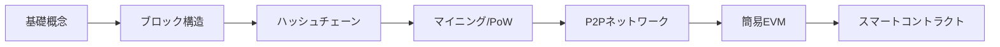

# 🔗 Zigで学ぶブロックチェーン実装入門

<p align="center">
  
  
  
</p>


[](https://github.com/susumutomita/BlockChain/actions/workflows/ci.yml)

## ⚠️ 重要：教育用コンテンツです

**本プロジェクトは学習目的専用です。実際の暗号通貨や商用システムでの使用は絶対に避けてください。**

- ✅ ブロックチェーンの仕組みを理解するための教材
- ✅ Zig言語の実践的な学習
- ❌ 本番環境での使用
- ❌ 実際の資産を扱うシステム

## 📚 この本で学べること

### 🎯 到達目標
ブロックチェーンの仕組みを**実装レベル**で理解し、簡易的なEVMまで自作できるようになります。

### 📊 学習の流れ



## 📖 章構成と内容

### 第1章：はじめに - ブロックチェーンとは何か
- ブロックチェーンの基本概念
- 中央集権vs分散型の違い
- なぜZig言語を使うのか

### 第2章：開発環境のセットアップ
- Zigのインストール
- プロジェクト構成
- Hello, Blockchain!

### 第3章：最初のブロックを作ろう
- Block構造体の実装
- SHA-256ハッシュ計算
- ブロックの連鎖

```zig
// ブロックの基本構造
const Block = struct {
    index: u32,              // ブロック番号
    timestamp: u64,          // タイムスタンプ
    prev_hash: [32]u8,       // 前ブロックのハッシュ
    transactions: ArrayList, // トランザクション
    hash: [32]u8,           // このブロックのハッシュ
};
```

### 第4章：Proof of Work - マイニングの実装
- nonceとは何か
- 難易度の概念
- マイニングアルゴリズム

### 第5章：コードのリファクタリング
- モジュール分割
- エラーハンドリング
- テスト駆動開発

### 第6章：P2P通信の基礎
- TCP/IPソケット通信
- サーバー/クライアントモデル
- メッセージプロトコル

### 第7章：P2Pブロックチェーンネットワーク
- ノード間のブロック共有
- ゴシッププロトコル
- チェーンの同期

### 第8章：ネットワークの完全同期
- 最長チェーンルール
- フォーク処理
- 状態管理

### 第9章：簡易EVM実装
- スタックマシンの基礎
- 基本的なオペコード
- ガス計算の概念

### 第10章：トランザクション署名の基礎（簡易版）
- 公開鍵暗号の概念
- アドレス生成の仕組み
- 署名検証の基本

## 🚀 クイックスタート

### 必要な環境
- Zig 0.11.0以上
- Git
- テキストエディタ（VSCode推奨）

### 基本的な実行方法

```bash
# リポジトリのクローン
git clone https://github.com/susumutomita/BlockChain.git
cd BlockChain

# ビルド
zig build

# 実行
zig build run

# テスト
zig build test
```

### P2Pネットワークの起動

```bash
# ノード1（ポート8000）
zig build run -- --listen 8000

# ノード2（ノード1に接続）
zig build run -- --listen 8001 --connect 127.0.0.1:8000
```

## 🎓 学習のポイント

### なぜZig言語？
- **明示的なメモリ管理**：ブロックチェーンの仕組みを深く理解
- **低レベル制御**：ハッシュ計算やバイト操作を直接実装
- **シンプルな言語仕様**：余計な抽象化がなく、本質に集中

### このプロジェクトの特徴
1. **段階的な実装**：各章で少しずつ機能を追加
2. **動くコード**：すべての章にサンプルコード付き
3. **実践的な内容**：実際のブロックチェーンの仕組みを簡略化して実装

## 📊 コードの規模

```
総行数: 約3,000行
ファイル数: 15個
テストカバレッジ: 基本機能のみ
```

## ⚡ 主な機能と制限

### ✅ 実装済み機能
- ブロックの生成とハッシュ計算
- Proof of Work（難易度調整可能）
- P2Pネットワーク（TCP/IP）
- 簡易EVM（20オペコード）
- ブロックチェーンの同期

### ❌ 未実装/簡略化
- トランザクション署名（概念のみ）
- 永続化（メモリのみ）
- 本格的なセキュリティ
- スケーラビリティ対策

## 🤝 想定読者

- ブロックチェーンの仕組みを**コードで**理解したい方
- Zig言語に興味がある方
- 低レベルプログラミングを学びたい方
- 「動かしながら学ぶ」スタイルが好きな方

## 📝 ライセンスと利用規約

MIT License - 教育目的での利用を推奨

**再度警告：本実装は教育目的のみ。実運用での使用は危険です。**

## 🌟 今後の学習ステップ

本書を終えた後の推奨学習パス：

1. **より実践的な実装へ**
   - Substrate（Rust）
   - go-ethereum（Go）
   
2. **理論の深堀り**
   - 暗号理論
   - 分散システム論
   
3. **実用的なdApp開発**
   - Solidity
   - Web3開発

---

<p align="center">
  <strong>🎯 ブロックチェーンを「作って」理解する、新しい学習体験を！</strong>
</p>