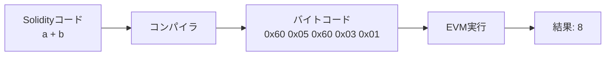

## オペコードとは何か

前章でEVMの基本的なデータ構造を実装しました。本章では、これらのデータ構造を操作する**オペコード**（命令）を実装します。

オペコードは1バイト（8ビット）で表現される命令で、EVMが理解できる唯一の言語です。人間が書くSolidityコードは、最終的にこれらのオペコードの列（バイトコード）にコンパイルされます。



## オペコードの分類

EVMには約140のオペコードがありますが、大きく以下のカテゴリに分類できます：

1. **算術演算**: ADD、SUB、MUL、DIV など
2. **比較演算**: LT、GT、EQ、ISZERO など
3. **ビット演算**: AND、OR、XOR、NOT など
4. **スタック操作**: PUSH、POP、DUP、SWAP など
5. **メモリ操作**: MLOAD、MSTORE、MSTORE8 など
6. **ストレージ操作**: SLOAD、SSTORE など
7. **制御フロー**: JUMP、JUMPI、PC、STOP など
8. **システム操作**: CALL、CREATE、RETURN など

本章では、基本的な演算とスタック操作を中心に実装します。

## オペコード定義

```zig
/// EVMオペコード定義
pub const Opcode = struct {
    // 終了・システム
    pub const STOP = 0x00;
    pub const INVALID = 0xFE;
    
    // 算術演算
    pub const ADD = 0x01;      // 加算
    pub const MUL = 0x02;      // 乗算
    pub const SUB = 0x03;      // 減算
    pub const DIV = 0x04;      // 除算
    pub const MOD = 0x06;      // 剰余
    pub const EXP = 0x0A;      // 累乗
    
    // 比較・論理演算
    pub const LT = 0x10;       // より小さい
    pub const GT = 0x11;       // より大きい
    pub const EQ = 0x14;       // 等しい
    pub const ISZERO = 0x15;   // ゼロかどうか
    pub const AND = 0x16;      // ビットAND
    pub const OR = 0x17;       // ビットOR
    pub const XOR = 0x18;      // ビットXOR
    pub const NOT = 0x19;      // ビットNOT
    
    // スタック操作
    pub const POP = 0x50;      // スタックトップを削除
    pub const PUSH0 = 0x5F;    // 0をプッシュ
    pub const PUSH1 = 0x60;    // 1バイトをプッシュ
    pub const PUSH2 = 0x61;    // 2バイトをプッシュ
    // ... PUSH3からPUSH32まで続く
    
    pub const DUP1 = 0x80;     // 1番目を複製
    pub const DUP2 = 0x81;     // 2番目を複製
    // ... DUP3からDUP16まで続く
    
    pub const SWAP1 = 0x90;    // 1番目と交換
    pub const SWAP2 = 0x91;    // 2番目と交換
    // ... SWAP3からSWAP16まで続く
    
    // メモリ操作
    pub const MLOAD = 0x51;    // メモリから読み込み
    pub const MSTORE = 0x52;   // メモリに書き込み
    pub const MSTORE8 = 0x53;  // 1バイトを書き込み
    
    // ストレージ操作
    pub const SLOAD = 0x54;    // ストレージから読み込み
    pub const SSTORE = 0x55;   // ストレージに書き込み
    
    // 制御フロー
    pub const PC = 0x58;       // プログラムカウンタ
    pub const JUMP = 0x56;     // ジャンプ
    pub const JUMPI = 0x57;    // 条件付きジャンプ
    pub const JUMPDEST = 0x5B; // ジャンプ先マーカー
};
```

## ガス料金の定義

各オペコードには実行コスト（ガス）があります：

```zig
/// ガス料金定義
pub const GasCost = struct {
    pub const G_ZERO = 0;        // 無料
    pub const G_BASE = 2;        // 基本料金
    pub const G_VERYLOW = 3;     // 非常に安い
    pub const G_LOW = 5;         // 安い
    pub const G_MID = 8;         // 中程度
    pub const G_HIGH = 10;       // 高い
    pub const G_JUMPDEST = 1;    // JUMPDEST
    pub const G_MEMORY = 3;      // メモリ操作
    pub const G_SSET = 20000;    // ストレージ書き込み（新規）
    pub const G_SRESET = 5000;   // ストレージ書き込み（更新）
};

/// オペコードのガス料金を取得
pub fn getGasCost(opcode: u8) usize {
    return switch (opcode) {
        Opcode.STOP => GasCost.G_ZERO,
        Opcode.ADD, Opcode.SUB, Opcode.LT, Opcode.GT, 
        Opcode.EQ, Opcode.ISZERO, Opcode.AND, Opcode.OR, 
        Opcode.XOR, Opcode.NOT => GasCost.G_VERYLOW,
        Opcode.MUL, Opcode.DIV, Opcode.MOD => GasCost.G_LOW,
        Opcode.EXP => GasCost.G_HIGH,
        Opcode.PUSH0...Opcode.PUSH1 + 31 => GasCost.G_VERYLOW,
        Opcode.DUP1...Opcode.DUP1 + 15 => GasCost.G_VERYLOW,
        Opcode.SWAP1...Opcode.SWAP1 + 15 => GasCost.G_VERYLOW,
        Opcode.POP => GasCost.G_BASE,
        Opcode.MLOAD, Opcode.MSTORE => GasCost.G_VERYLOW,
        Opcode.SLOAD => GasCost.G_SRESET,
        Opcode.SSTORE => GasCost.G_SSET,  // 簡易版
        Opcode.PC => GasCost.G_BASE,
        Opcode.JUMP, Opcode.JUMPI => GasCost.G_MID,
        Opcode.JUMPDEST => GasCost.G_JUMPDEST,
        else => GasCost.G_BASE,
    };
}
```

## 実行エンジンの実装

オペコードを順次実行するメインループ：

```zig
const std = @import("std");
const evm_types = @import("evm_types.zig");
const EVMu256 = evm_types.EVMu256;
const EvmContext = evm_types.EvmContext;

/// EVMエラー型
pub const EVMError = error{
    OutOfGas,
    StackOverflow,
    StackUnderflow,
    InvalidOpcode,
    InvalidJumpDestination,
    OutOfBounds,
};

/// EVMバイトコードを実行
pub fn execute(ctx: *EvmContext) !void {
    while (ctx.pc < ctx.code.len and !ctx.stopped) {
        const opcode = ctx.code[ctx.pc];
        
        // ガス消費
        const gas_cost = getGasCost(opcode);
        try ctx.useGas(gas_cost);
        
        // デバッグ出力（開発時のみ）
        if (builtin.mode == .Debug) {
            std.debug.print("PC: {d}, Opcode: 0x{x:0>2}, Gas: {d}\n", .{
                ctx.pc,
                opcode,
                ctx.gas_remaining,
            });
        }
        
        // オペコード実行
        try executeOpcode(ctx, opcode);
        
        // JUMP系以外はプログラムカウンタを進める
        if (opcode != Opcode.JUMP and opcode != Opcode.JUMPI) {
            ctx.pc += 1;
        }
    }
}

/// 単一のオペコードを実行
fn executeOpcode(ctx: *EvmContext, opcode: u8) !void {
    switch (opcode) {
        // 終了
        Opcode.STOP => {
            ctx.stopped = true;
        },
        
        // 算術演算
        Opcode.ADD => try executeAdd(ctx),
        Opcode.MUL => try executeMul(ctx),
        Opcode.SUB => try executeSub(ctx),
        Opcode.DIV => try executeDiv(ctx),
        Opcode.MOD => try executeMod(ctx),
        
        // 比較演算
        Opcode.LT => try executeLt(ctx),
        Opcode.GT => try executeGt(ctx),
        Opcode.EQ => try executeEq(ctx),
        Opcode.ISZERO => try executeIsZero(ctx),
        
        // ビット演算
        Opcode.AND => try executeAnd(ctx),
        Opcode.OR => try executeOr(ctx),
        Opcode.XOR => try executeXor(ctx),
        Opcode.NOT => try executeNot(ctx),
        
        // スタック操作
        Opcode.POP => try executePop(ctx),
        Opcode.PUSH0 => try executePush0(ctx),
        Opcode.PUSH1...Opcode.PUSH1 + 31 => try executePushN(ctx, opcode),
        Opcode.DUP1...Opcode.DUP1 + 15 => try executeDupN(ctx, opcode),
        Opcode.SWAP1...Opcode.SWAP1 + 15 => try executeSwapN(ctx, opcode),
        
        // メモリ操作
        Opcode.MLOAD => try executeMload(ctx),
        Opcode.MSTORE => try executeMstore(ctx),
        
        // ストレージ操作
        Opcode.SLOAD => try executeSload(ctx),
        Opcode.SSTORE => try executeSstore(ctx),
        
        // 制御フロー
        Opcode.PC => try executePc(ctx),
        Opcode.JUMP => try executeJump(ctx),
        Opcode.JUMPI => try executeJumpi(ctx),
        Opcode.JUMPDEST => {}, // 何もしない（ジャンプ先マーカー）
        
        else => {
            std.debug.print("Invalid opcode: 0x{x:0>2}\n", .{opcode});
            return EVMError.InvalidOpcode;
        },
    }
}
```

## 算術演算の実装

```zig
/// ADD: 加算
fn executeAdd(ctx: *EvmContext) !void {
    const b = try ctx.stack.pop();
    const a = try ctx.stack.pop();
    try ctx.stack.push(a.add(b));
}

/// MUL: 乗算
fn executeMul(ctx: *EvmContext) !void {
    const b = try ctx.stack.pop();
    const a = try ctx.stack.pop();
    
    // 簡易版：両方の上位ビットが0の場合のみ正確
    if (a.hi == 0 and b.hi == 0) {
        const result = @as(u256, a.lo) * @as(u256, b.lo);
        try ctx.stack.push(EVMu256{
            .hi = @truncate(result >> 128),
            .lo = @truncate(result),
        });
    } else {
        // 完全な256ビット乗算は複雑なため省略
        try ctx.stack.push(EVMu256{
            .hi = 0,
            .lo = a.lo *% b.lo,
        });
    }
}

/// SUB: 減算
fn executeSub(ctx: *EvmContext) !void {
    const b = try ctx.stack.pop();
    const a = try ctx.stack.pop();
    try ctx.stack.push(a.sub(b));
}

/// DIV: 除算
fn executeDiv(ctx: *EvmContext) !void {
    const b = try ctx.stack.pop();
    const a = try ctx.stack.pop();
    
    // ゼロ除算の場合は0を返す（EVMの仕様）
    if (b.isZero()) {
        try ctx.stack.push(EVMu256.zero());
    } else if (a.hi == 0 and b.hi == 0) {
        // 簡易版：128ビット以内の除算
        try ctx.stack.push(EVMu256.fromU64(a.lo / b.lo));
    } else {
        // 完全な256ビット除算は複雑なため省略
        try ctx.stack.push(EVMu256.zero());
    }
}

/// MOD: 剰余
fn executeMod(ctx: *EvmContext) !void {
    const b = try ctx.stack.pop();
    const a = try ctx.stack.pop();
    
    if (b.isZero()) {
        try ctx.stack.push(EVMu256.zero());
    } else if (a.hi == 0 and b.hi == 0) {
        try ctx.stack.push(EVMu256.fromU64(a.lo % b.lo));
    } else {
        try ctx.stack.push(EVMu256.zero());
    }
}
```

## 比較演算の実装

```zig
/// LT: より小さい
fn executeLt(ctx: *EvmContext) !void {
    const b = try ctx.stack.pop();
    const a = try ctx.stack.pop();
    
    const result = if (a.hi < b.hi or (a.hi == b.hi and a.lo < b.lo))
        EVMu256.one()
    else
        EVMu256.zero();
        
    try ctx.stack.push(result);
}

/// GT: より大きい
fn executeGt(ctx: *EvmContext) !void {
    const b = try ctx.stack.pop();
    const a = try ctx.stack.pop();
    
    const result = if (a.hi > b.hi or (a.hi == b.hi and a.lo > b.lo))
        EVMu256.one()
    else
        EVMu256.zero();
        
    try ctx.stack.push(result);
}

/// EQ: 等しい
fn executeEq(ctx: *EvmContext) !void {
    const b = try ctx.stack.pop();
    const a = try ctx.stack.pop();
    
    const result = if (a.eq(b))
        EVMu256.one()
    else
        EVMu256.zero();
        
    try ctx.stack.push(result);
}

/// ISZERO: ゼロかどうか
fn executeIsZero(ctx: *EvmContext) !void {
    const a = try ctx.stack.pop();
    
    const result = if (a.isZero())
        EVMu256.one()
    else
        EVMu256.zero();
        
    try ctx.stack.push(result);
}
```

## ビット演算の実装

```zig
/// AND: ビットAND
fn executeAnd(ctx: *EvmContext) !void {
    const b = try ctx.stack.pop();
    const a = try ctx.stack.pop();
    
    try ctx.stack.push(EVMu256{
        .hi = a.hi & b.hi,
        .lo = a.lo & b.lo,
    });
}

/// OR: ビットOR
fn executeOr(ctx: *EvmContext) !void {
    const b = try ctx.stack.pop();
    const a = try ctx.stack.pop();
    
    try ctx.stack.push(EVMu256{
        .hi = a.hi | b.hi,
        .lo = a.lo | b.lo,
    });
}

/// XOR: ビットXOR
fn executeXor(ctx: *EvmContext) !void {
    const b = try ctx.stack.pop();
    const a = try ctx.stack.pop();
    
    try ctx.stack.push(EVMu256{
        .hi = a.hi ^ b.hi,
        .lo = a.lo ^ b.lo,
    });
}

/// NOT: ビットNOT
fn executeNot(ctx: *EvmContext) !void {
    const a = try ctx.stack.pop();
    
    try ctx.stack.push(EVMu256{
        .hi = ~a.hi,
        .lo = ~a.lo,
    });
}
```

## スタック操作の実装

```zig
/// POP: スタックトップを削除
fn executePop(ctx: *EvmContext) !void {
    _ = try ctx.stack.pop();
}

/// PUSH0: 0をプッシュ
fn executePush0(ctx: *EvmContext) !void {
    try ctx.stack.push(EVMu256.zero());
}

/// PUSHN: Nバイトをプッシュ
fn executePushN(ctx: *EvmContext, opcode: u8) !void {
    const n = opcode - Opcode.PUSH1 + 1;
    ctx.pc += 1;
    
    if (ctx.pc + n > ctx.code.len) {
        return EVMError.OutOfBounds;
    }
    
    // Nバイトを読み取って256ビット整数に変換
    const bytes = ctx.code[ctx.pc..ctx.pc + n];
    const value = EVMu256.fromBytes(bytes);
    try ctx.stack.push(value);
    
    // 読み取ったバイト数分PCを進める
    ctx.pc += n - 1;
}

/// DUPN: N番目の要素を複製
fn executeDupN(ctx: *EvmContext, opcode: u8) !void {
    const n = opcode - Opcode.DUP1 + 1;
    try ctx.stack.dup(n);
}

/// SWAPN: N番目の要素と交換
fn executeSwapN(ctx: *EvmContext, opcode: u8) !void {
    const n = opcode - Opcode.SWAP1 + 1;
    try ctx.stack.swap(n);
}
```

## メモリ・ストレージ操作の実装

```zig
/// MLOAD: メモリから読み込み
fn executeMload(ctx: *EvmContext) !void {
    const offset = try ctx.stack.pop();
    // オフセットは実用上u64の範囲で十分
    const offset_usize = @as(usize, @intCast(offset.lo));
    const value = ctx.memory.load(offset_usize);
    try ctx.stack.push(value);
}

/// MSTORE: メモリに書き込み
fn executeMstore(ctx: *EvmContext) !void {
    const offset = try ctx.stack.pop();
    const value = try ctx.stack.pop();
    const offset_usize = @as(usize, @intCast(offset.lo));
    try ctx.memory.store(offset_usize, value);
}

/// SLOAD: ストレージから読み込み
fn executeSload(ctx: *EvmContext) !void {
    const key = try ctx.stack.pop();
    const value = ctx.storage.load(key);
    try ctx.stack.push(value);
}

/// SSTORE: ストレージに書き込み
fn executeSstore(ctx: *EvmContext) !void {
    const key = try ctx.stack.pop();
    const value = try ctx.stack.pop();
    try ctx.storage.store(key, value);
}
```

## 実行例：簡単な計算

### 例1: 5 + 3を計算

```zig
test "simple addition" {
    const allocator = std.testing.allocator;
    
    // バイトコード: PUSH1 5, PUSH1 3, ADD, STOP
    const code = [_]u8{ 0x60, 0x05, 0x60, 0x03, 0x01, 0x00 };
    
    var ctx = EvmContext.init(allocator, &code, &[_]u8{}, 1000);
    defer ctx.deinit();
    
    try execute(&ctx);
    
    // 結果確認
    const result = try ctx.stack.pop();
    try std.testing.expectEqual(@as(u128, 8), result.lo);
}
```

実行の流れ：
1. `PUSH1 5`: スタックに5をプッシュ → Stack: [5]
2. `PUSH1 3`: スタックに3をプッシュ → Stack: [5, 3]
3. `ADD`: 5と3を加算 → Stack: [8]
4. `STOP`: 実行停止

### 例2: (2 + 3) × 4を計算

```zig
test "compound calculation" {
    const allocator = std.testing.allocator;
    
    // バイトコード: PUSH1 2, PUSH1 3, ADD, PUSH1 4, MUL, STOP
    const code = [_]u8{ 
        0x60, 0x02,  // PUSH1 2
        0x60, 0x03,  // PUSH1 3
        0x01,        // ADD
        0x60, 0x04,  // PUSH1 4
        0x02,        // MUL
        0x00         // STOP
    };
    
    var ctx = EvmContext.init(allocator, &code, &[_]u8{}, 1000);
    defer ctx.deinit();
    
    try execute(&ctx);
    
    const result = try ctx.stack.pop();
    try std.testing.expectEqual(@as(u128, 20), result.lo);
}
```

### 例3: 条件分岐（10 > 5なら1、そうでなければ0）

```zig
test "conditional logic" {
    const allocator = std.testing.allocator;
    
    // バイトコード: PUSH1 5, PUSH1 10, GT, STOP
    const code = [_]u8{ 
        0x60, 0x05,  // PUSH1 5
        0x60, 0x0A,  // PUSH1 10
        0x11,        // GT (10 > 5?)
        0x00         // STOP
    };
    
    var ctx = EvmContext.init(allocator, &code, &[_]u8{}, 1000);
    defer ctx.deinit();
    
    try execute(&ctx);
    
    const result = try ctx.stack.pop();
    try std.testing.expectEqual(@as(u128, 1), result.lo);
}
```

## デバッグツール

開発時に役立つデバッグ関数：

```zig
/// スタックの状態を表示
pub fn printStack(ctx: *const EvmContext) void {
    std.debug.print("Stack (depth={}): [", .{ctx.stack.depth()});
    
    var i: usize = 0;
    while (i < ctx.stack.top) : (i += 1) {
        const value = ctx.stack.data[i];
        if (value.hi == 0) {
            std.debug.print("{}", .{value.lo});
        } else {
            std.debug.print("0x{x:0>32}{x:0>32}", .{ value.hi, value.lo });
        }
        if (i < ctx.stack.top - 1) {
            std.debug.print(", ", .{});
        }
    }
    
    std.debug.print("]\n", .{});
}

/// 実行トレースを表示
pub fn traceExecution(ctx: *EvmContext) !void {
    std.debug.print("\n=== EVM Execution Trace ===\n", .{});
    
    while (ctx.pc < ctx.code.len and !ctx.stopped) {
        const opcode = ctx.code[ctx.pc];
        const gas_before = ctx.gas_remaining;
        
        // 実行前の状態
        std.debug.print("\nPC: {d}, Opcode: ", .{ctx.pc});
        printOpcodeName(opcode);
        std.debug.print(" (0x{x:0>2})\n", .{opcode});
        std.debug.print("Gas: {d}\n", .{gas_before});
        printStack(ctx);
        
        // オペコード実行
        const gas_cost = getGasCost(opcode);
        try ctx.useGas(gas_cost);
        try executeOpcode(ctx, opcode);
        
        // 実行後の状態
        std.debug.print("Gas used: {d}\n", .{gas_cost});
        printStack(ctx);
        
        if (opcode != Opcode.JUMP and opcode != Opcode.JUMPI) {
            ctx.pc += 1;
        }
    }
    
    std.debug.print("\n=== Execution Complete ===\n", .{});
    std.debug.print("Total gas used: {d}\n", .{ctx.gas_used});
}

/// オペコード名を表示
fn printOpcodeName(opcode: u8) void {
    const name = switch (opcode) {
        0x00 => "STOP",
        0x01 => "ADD",
        0x02 => "MUL",
        0x03 => "SUB",
        0x04 => "DIV",
        0x06 => "MOD",
        0x10 => "LT",
        0x11 => "GT",
        0x14 => "EQ",
        0x15 => "ISZERO",
        0x16 => "AND",
        0x17 => "OR",
        0x18 => "XOR",
        0x19 => "NOT",
        0x50 => "POP",
        0x51 => "MLOAD",
        0x52 => "MSTORE",
        0x54 => "SLOAD",
        0x55 => "SSTORE",
        0x56 => "JUMP",
        0x57 => "JUMPI",
        0x58 => "PC",
        0x5B => "JUMPDEST",
        0x5F => "PUSH0",
        0x60...0x7F => blk: {
            std.debug.print("PUSH{}", .{opcode - 0x60 + 1});
            break :blk "";
        },
        0x80...0x8F => blk: {
            std.debug.print("DUP{}", .{opcode - 0x80 + 1});
            break :blk "";
        },
        0x90...0x9F => blk: {
            std.debug.print("SWAP{}", .{opcode - 0x90 + 1});
            break :blk "";
        },
        else => "UNKNOWN",
    };
    
    if (opcode < 0x60 or opcode > 0x9F) {
        std.debug.print("{s}", .{name});
    }
}
```

## パフォーマンス最適化

実用的なEVMでは以下の最適化が重要です：

```zig
/// オペコードディスパッチテーブル
const OpcodeFn = fn(ctx: *EvmContext) EVMError!void;
const dispatch_table = blk: {
    var table: [256]?OpcodeFn = [_]?OpcodeFn{null} ** 256;
    
    table[Opcode.STOP] = executeStop;
    table[Opcode.ADD] = executeAdd;
    table[Opcode.MUL] = executeMul;
    // ... 他のオペコード
    
    break :blk table;
};

/// 最適化された実行関数
pub fn executeOptimized(ctx: *EvmContext) !void {
    while (ctx.pc < ctx.code.len and !ctx.stopped) {
        const opcode = ctx.code[ctx.pc];
        
        // ガス消費
        const gas_cost = gas_table[opcode];
        if (ctx.gas_remaining < gas_cost) {
            return error.OutOfGas;
        }
        ctx.gas_remaining -= gas_cost;
        ctx.gas_used += gas_cost;
        
        // ディスパッチテーブルを使用
        if (dispatch_table[opcode]) |handler| {
            try handler(ctx);
        } else {
            return error.InvalidOpcode;
        }
        
        // PCの更新
        if (opcode != Opcode.JUMP and opcode != Opcode.JUMPI) {
            ctx.pc += 1;
        }
    }
}
```

## まとめ

本章では、EVMの基本的なオペコードを実装しました：

1. **算術演算**: ADD、MUL、SUB、DIV、MOD
2. **比較演算**: LT、GT、EQ、ISZERO
3. **ビット演算**: AND、OR、XOR、NOT
4. **スタック操作**: PUSH、POP、DUP、SWAP
5. **メモリ操作**: MLOAD、MSTORE
6. **ストレージ操作**: SLOAD、SSTORE
7. **制御フロー**: PC、JUMP、JUMPI、JUMPDEST

これらの基本的なオペコードにより、簡単な計算プログラムを実行できるようになりました。次章では、より高度な機能（関数呼び出し、コントラクト実行）を実装し、実際のSolidityコントラクトを動かせるようにします。

## 演習問題

1. **EXP（累乗）オペコード**を実装してみましょう
2. **BYTE オペコード**（指定位置のバイトを取得）を実装してみましょう
3. **SHL/SHR（ビットシフト）オペコード**を実装してみましょう
4. **メモリ使用量に応じたガス計算**を実装してみましょう
5. **オペコードの実行頻度を計測**する機能を追加してみましょう

次章では、これらの基盤の上に実際のスマートコントラクトを実行する機能を構築します。