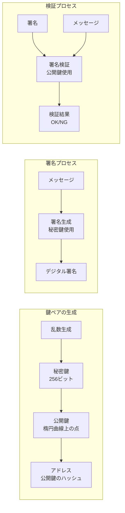

## 第10章：トランザクション署名の基礎

これまでの章では、ブロックチェーンの基本構造、マイニング、P2Pネットワーク、そしてEVMの実装を学んできました。しかし、重要な要素が1つ欠けています。それは**トランザクションの正当性をどう証明するか**という問題です。

### なぜ署名が必要か

現在の実装では、誰でも任意のトランザクションを作成できてしまいます：

```zig
// 現在の実装（署名なし）
const tx = Transaction{
    .sender = "Alice",     // 誰でもAliceになりすませる！
    .receiver = "Bob",
    .amount = 100,
};
```

これでは、悪意のあるユーザーが他人になりすまして資金を送金できてしまいます。

### 公開鍵暗号の基本概念



### Ethereumアドレスの仕組み

Ethereumでは、以下の手順でアドレスが生成されます：

1. **秘密鍵の生成**：256ビットのランダムな数値
2. **公開鍵の導出**：楕円曲線暗号（secp256k1）を使用
3. **アドレスの計算**：公開鍵のKeccak-256ハッシュの下位20バイト

```
秘密鍵: 0x4c0883a69102937d6231471b5dbb6204fe512961...
     ↓ (楕円曲線演算)
公開鍵: 0x04d90d6c82b8b5e...（65バイト）
     ↓ (Keccak-256ハッシュ)
ハッシュ: 0x3f17f1962b36e491b30a40b2405849e597ba5fb5...
     ↓ (下位20バイト)
アドレス: 0x405849e597ba5fb5...
```

### 署名付きトランザクションの概念

実際のブロックチェーンでは、トランザクションは以下のような構造になります：

```zig
// 概念的な署名付きトランザクション
const SignedTransaction = struct {
    // トランザクションデータ
    to: [20]u8,      // 送信先アドレス
    value: u256,     // 送金額
    nonce: u64,      // リプレイ攻撃防止
    
    // 署名データ
    v: u8,           // 回復ID
    r: [32]u8,       // 署名のr値
    s: [32]u8,       // 署名のs値
};
```

### 署名の重要性

デジタル署名は以下を保証します：

1. **認証（Authentication）**：送信者が本当にその秘密鍵の所有者か
2. **完全性（Integrity）**：トランザクションが改ざんされていないか
3. **否認防止（Non-repudiation）**：後から「送っていない」と否定できない

### 簡易実装の方向性

完全な暗号実装は複雑なため、教育目的では以下のような簡易版を考えます：

```zig
// 教育用の簡易ウォレット（概念のみ）
pub const SimpleWallet = struct {
    private_key: [32]u8,
    public_key: [33]u8,  // 圧縮形式
    address: [20]u8,
    
    // 疑似的な署名生成（本番では使用不可）
    pub fn sign(self: *SimpleWallet, message: []const u8) [64]u8 {
        // 実際にはsecp256k1の楕円曲線署名が必要
        // ここでは概念理解のための疑似実装
        var signature: [64]u8 = undefined;
        // ... 署名ロジック ...
        return signature;
    }
    
    // アドレス導出の説明
    pub fn deriveAddress(public_key: [33]u8) [20]u8 {
        // 1. 公開鍵を展開（圧縮形式→非圧縮形式）
        // 2. Keccak-256ハッシュを計算
        // 3. 下位20バイトを取得
        var address: [20]u8 = undefined;
        // ... アドレス計算ロジック ...
        return address;
    }
};
```

### セキュリティ上の注意

⚠️ **重要な警告**：
- 本章の実装は**教育目的のみ**です
- 実際の暗号実装には、検証済みのライブラリ（libsecp256k1等）を使用してください
- 秘密鍵の管理は極めて重要です（平文保存は絶対NG）
- 乱数生成には暗号学的に安全な乱数生成器が必要です

### まとめ

トランザクション署名は、ブロックチェーンの信頼性を支える重要な要素です。本章では概念の理解に焦点を当てましたが、実際の実装では：

- 楕円曲線暗号（ECDSA）の正確な実装
- ハードウェアウォレットとの連携
- マルチシグ（複数署名）の仕組み
- HD（階層的決定性）ウォレット

などの高度な機能が必要になります。

### 演習問題

1. なぜ秘密鍵から公開鍵は計算できるが、逆はできないのか説明せよ
2. アドレスの衝突確率を計算せよ（20バイト = 160ビット）
3. リプレイ攻撃とは何か、nonceがどう防ぐか説明せよ

### 次のステップ

次章では、これまで学んだ全ての要素を組み合わせて、簡単なスマートコントラクトを実装し、実際にEVM上で動かしてみます。