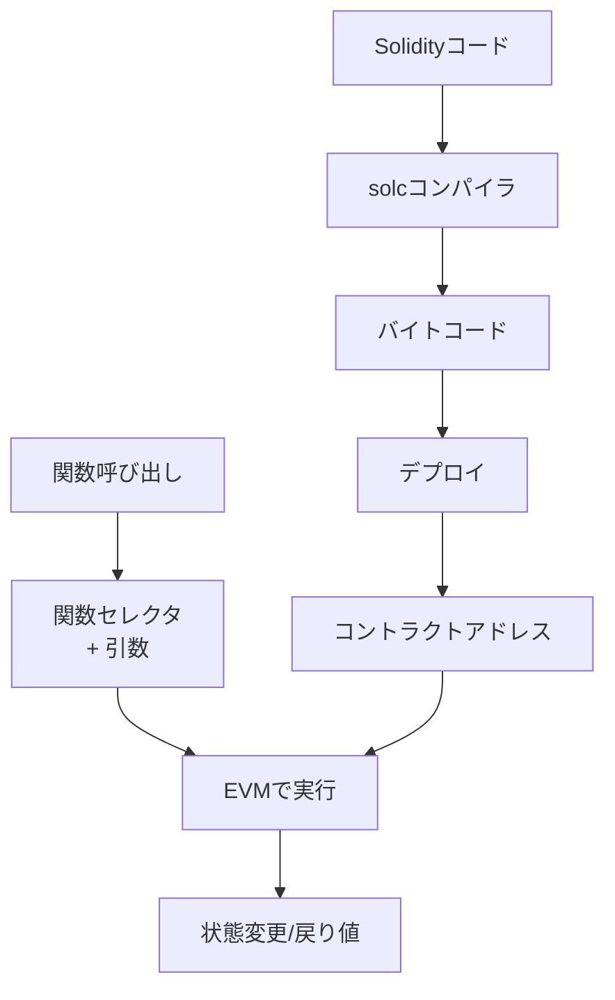

## いよいよスマートコントラクトを動かす

前章までで基本的なEVMオペコードを実装しました。本章では、実際のSolidityで書かれたスマートコントラクトをコンパイルし、EVMで実行できるようにします。

これは、単なる計算機から、プログラム可能なブロックチェーンへの大きな飛躍です。

## Solidityとは

Solidityは、Ethereumのスマートコントラクトを記述するための高級プログラミング言語です。JavaScriptに似た構文を持ち、静的型付けされています。

```solidity
// 簡単なカウンターコントラクト
pragma solidity ^0.8.0;

contract Counter {
    uint256 public count;
    
    function increment() public {
        count += 1;
    }
}
```

このSolidityコードは、コンパイラによってEVMバイトコードに変換されます。

## コントラクト実行の流れ



## 関数セレクタの仕組み

Solidityの関数呼び出しは、**関数セレクタ**という仕組みで実装されています。

```zig
/// 関数セレクタを計算（Keccak256の最初の4バイト）
pub fn calculateSelector(function_signature: []const u8) [4]u8 {
    var hash: [32]u8 = undefined;
    std.crypto.hash.sha3.Keccak256.hash(function_signature, &hash, .{});
    
    var selector: [4]u8 = undefined;
    @memcpy(&selector, hash[0..4]);
    return selector;
}

test "function selector" {
    // "transfer(address,uint256)" のセレクタ
    const selector = calculateSelector("transfer(address,uint256)");
    // 0xa9059cbb になるはず
    try std.testing.expectEqual([4]u8{ 0xa9, 0x05, 0x9c, 0xbb }, selector);
}
```

## CALLDATAとRETURNの実装

関数呼び出しには、引数の受け渡しと戻り値の返却が必要です。

```zig
/// CALLDATALOAD: 呼び出しデータを読み込み
fn executeCalldataload(ctx: *EvmContext) !void {
    const offset = try ctx.stack.pop();
    const offset_usize = @as(usize, @intCast(offset.lo));
    
    // 32バイトを読み込み（足りない部分は0埋め）
    var bytes: [32]u8 = [_]u8{0} ** 32;
    const available = if (offset_usize < ctx.calldata.len)
        @min(32, ctx.calldata.len - offset_usize)
    else
        0;
    
    if (available > 0) {
        @memcpy(bytes[0..available], ctx.calldata[offset_usize..offset_usize + available]);
    }
    
    try ctx.stack.push(EVMu256.fromBytes(&bytes));
}

/// CALLDATASIZE: 呼び出しデータのサイズ
fn executeCalldatasize(ctx: *EvmContext) !void {
    try ctx.stack.push(EVMu256.fromU64(@intCast(ctx.calldata.len)));
}

/// RETURN: 実行結果を返す
fn executeReturn(ctx: *EvmContext) !void {
    const offset = try ctx.stack.pop();
    const length = try ctx.stack.pop();
    
    const mem_offset = @as(usize, @intCast(offset.lo));
    const mem_length = @as(usize, @intCast(length.lo));
    
    // メモリから戻り値データをコピー
    if (mem_offset + mem_length <= ctx.memory.size()) {
        const return_data = try ctx.allocator.alloc(u8, mem_length);
        @memcpy(return_data, ctx.memory.data.items[mem_offset..mem_offset + mem_length]);
        ctx.return_data = return_data;
    }
    
    ctx.stopped = true;
}
```

## 実際のSolidityコントラクトを実行

### 1. SimpleAdder - 加算コントラクト

```solidity
// SimpleAdder.sol
pragma solidity ^0.8.0;

contract SimpleAdder {
    function add(uint256 a, uint256 b) public pure returns (uint256) {
        return a + b;
    }
}
```

このコントラクトをコンパイルしてEVMで実行します：

```zig
const std = @import("std");
const evm = @import("evm.zig");
const evm_types = @import("evm_types.zig");

/// SimpleAdderコントラクトを実行
pub fn runSimpleAdder() !void {
    const allocator = std.heap.page_allocator;
    
    // コンパイル済みのランタイムバイトコード（実際にはsolcで生成）
    // これは簡略化されたバージョン
    const bytecode = [_]u8{
        // 関数セレクタのチェック
        0x60, 0x00,         // PUSH1 0x00
        0x35,               // CALLDATALOAD
        0x60, 0xe0,         // PUSH1 0xe0
        0x1c,               // SHR (右シフト224ビット = セレクタ抽出)
        
        // add(uint256,uint256) のセレクタ: 0x771602f7
        0x63, 0x77, 0x16, 0x02, 0xf7,  // PUSH4 0x771602f7
        0x14,               // EQ
        0x60, 0x20,         // PUSH1 0x20 (ジャンプ先)
        0x57,               // JUMPI
        
        // セレクタが一致しない場合
        0x00,               // STOP
        
        // add関数の実装（0x20）
        0x5b,               // JUMPDEST
        0x60, 0x04,         // PUSH1 0x04 (第1引数のオフセット)
        0x35,               // CALLDATALOAD
        0x60, 0x24,         // PUSH1 0x24 (第2引数のオフセット)
        0x35,               // CALLDATALOAD
        0x01,               // ADD
        
        // 結果を返す
        0x60, 0x00,         // PUSH1 0x00 (メモリオフセット)
        0x52,               // MSTORE
        0x60, 0x20,         // PUSH1 0x20 (長さ)
        0x60, 0x00,         // PUSH1 0x00 (オフセット)
        0xf3,               // RETURN
    };
    
    // add(5, 3)を呼び出すためのcalldata
    const calldata = try buildCalldata(allocator, "add(uint256,uint256)", &[_]u256{ 5, 3 });
    defer allocator.free(calldata);
    
    // EVM実行
    var ctx = evm_types.EvmContext.init(allocator, &bytecode, calldata, 100000);
    defer ctx.deinit();
    
    try evm.execute(&ctx);
    
    // 結果の確認
    if (ctx.return_data) |data| {
        const result = evm_types.EVMu256.fromBytes(data);
        std.debug.print("add(5, 3) = {d}\n", .{result.lo});  // 8
    }
}

/// Calldataを構築
fn buildCalldata(allocator: std.mem.Allocator, sig: []const u8, args: []const u256) ![]u8 {
    var calldata = std.ArrayList(u8).init(allocator);
    
    // 関数セレクタ
    const selector = calculateSelector(sig);
    try calldata.appendSlice(&selector);
    
    // 引数（各32バイト）
    for (args) |arg| {
        var bytes: [32]u8 = [_]u8{0} ** 32;
        // ビッグエンディアンで格納
        std.mem.writeIntBig(u256, &bytes, arg);
        try calldata.appendSlice(&bytes);
    }
    
    return calldata.toOwnedSlice();
}
```

### 2. Counter - 状態を持つコントラクト

```solidity
// Counter.sol
pragma solidity ^0.8.0;

contract Counter {
    uint256 public count;
    
    function increment() public {
        count = count + 1;
    }
    
    function getCount() public view returns (uint256) {
        return count;
    }
}
```

このコントラクトはストレージを使用します：

```zig
/// Counterコントラクトの実装（簡略版）
const counter_bytecode = [_]u8{
    // increment()の実装
    // count（スロット0）を読み込み
    0x60, 0x00,         // PUSH1 0x00 (key)
    0x54,               // SLOAD
    
    // 1を加算
    0x60, 0x01,         // PUSH1 0x01
    0x01,               // ADD
    
    // 結果を保存
    0x60, 0x00,         // PUSH1 0x00 (key)
    0x55,               // SSTORE
    
    // 終了
    0x00,               // STOP
};

test "counter increment" {
    const allocator = std.testing.allocator;
    
    var ctx = evm_types.EvmContext.init(allocator, &counter_bytecode, &[_]u8{}, 100000);
    defer ctx.deinit();
    
    // 初期値は0
    const initial = ctx.storage.load(EVMu256.zero());
    try std.testing.expectEqual(@as(u128, 0), initial.lo);
    
    // increment実行
    try evm.execute(&ctx);
    
    // カウントが1増えているはず
    const after = ctx.storage.load(EVMu256.zero());
    try std.testing.expectEqual(@as(u128, 1), after.lo);
}
```

### 3. 条件分岐を含むコントラクト

```solidity
// MaxFinder.sol
pragma solidity ^0.8.0;

contract MaxFinder {
    function max(uint256 a, uint256 b) public pure returns (uint256) {
        if (a > b) {
            return a;
        } else {
            return b;
        }
    }
}
```

条件分岐の実装：

```zig
/// max関数の実装（簡略版）
const max_bytecode = [_]u8{
    // 引数を読み込み
    0x60, 0x04,         // PUSH1 0x04
    0x35,               // CALLDATALOAD (a)
    0x60, 0x24,         // PUSH1 0x24
    0x35,               // CALLDATALOAD (b)
    
    // a > b をチェック
    0x81,               // DUP2 (a)
    0x81,               // DUP2 (b)
    0x11,               // GT
    
    // 条件分岐
    0x60, 0x20,         // PUSH1 0x20 (ジャンプ先: return a)
    0x57,               // JUMPI
    
    // else: return b
    0x50,               // POP (aを削除)
    0x60, 0x30,         // PUSH1 0x30 (ジャンプ先: 返却処理)
    0x56,               // JUMP
    
    // return a (0x20)
    0x5b,               // JUMPDEST
    0x50,               // POP (bを削除)
    
    // 返却処理 (0x30)
    0x5b,               // JUMPDEST
    0x60, 0x00,         // PUSH1 0x00
    0x52,               // MSTORE
    0x60, 0x20,         // PUSH1 0x20
    0x60, 0x00,         // PUSH1 0x00
    0xf3,               // RETURN
};
```

## コントラクトのデプロイ

実際のブロックチェーンでは、コントラクトをデプロイして初めて使用できます：

```zig
/// コントラクトデプロイの模擬実装
pub fn deployContract(
    allocator: std.mem.Allocator,
    deployment_code: []const u8,
    constructor_args: []const u8,
) !struct { address: [20]u8, runtime_code: []u8 } {
    // デプロイメントコードを実行
    var ctx = evm_types.EvmContext.init(
        allocator,
        deployment_code,
        constructor_args,
        3000000, // ガスリミット
    );
    defer ctx.deinit();
    
    try evm.execute(&ctx);
    
    // 返されたランタイムコード
    if (ctx.return_data) |runtime_code| {
        // アドレスを生成（簡易版：ハッシュの最初の20バイト）
        var address: [20]u8 = undefined;
        std.crypto.hash.sha3.Keccak256.hash(runtime_code, &address, .{});
        
        return .{
            .address = address,
            .runtime_code = try allocator.dupe(u8, runtime_code),
        };
    }
    
    return error.DeploymentFailed;
}
```

## ブロックチェーンへの統合

EVMをブロックチェーンに統合します：

```zig
/// トランザクションの種類
pub const TransactionType = enum {
    Transfer,        // 通常の送金
    ContractCall,    // コントラクト呼び出し
    ContractDeploy,  // コントラクトデプロイ
};

/// 拡張されたトランザクション構造体
pub const Transaction = struct {
    from: [20]u8,
    to: ?[20]u8,        // nullの場合はコントラクトデプロイ
    value: u256,
    data: []const u8,   // calldataまたはデプロイコード
    gas_limit: u64,
    nonce: u64,
    
    pub fn getType(self: Transaction) TransactionType {
        if (self.to == null) {
            return .ContractDeploy;
        } else if (self.data.len > 0) {
            return .ContractCall;
        } else {
            return .Transfer;
        }
    }
};

/// トランザクションを実行
pub fn executeTransaction(
    state: *BlockchainState,
    tx: Transaction,
) !TransactionReceipt {
    switch (tx.getType()) {
        .Transfer => {
            // 通常の送金
            try state.transfer(tx.from, tx.to.?, tx.value);
            return TransactionReceipt{
                .success = true,
                .gas_used = 21000,
            };
        },
        
        .ContractCall => {
            // コントラクトコードを取得
            const code = state.getCode(tx.to.?) orelse return error.ContractNotFound;
            
            // EVM実行
            var ctx = evm_types.EvmContext.init(
                state.allocator,
                code,
                tx.data,
                tx.gas_limit,
            );
            defer ctx.deinit();
            
            // 既存のストレージを読み込み
            ctx.storage = state.getStorage(tx.to.?);
            
            try evm.execute(&ctx);
            
            // ストレージの変更を保存
            state.updateStorage(tx.to.?, ctx.storage);
            
            return TransactionReceipt{
                .success = !ctx.reverted,
                .gas_used = ctx.gas_used,
                .return_data = ctx.return_data,
            };
        },
        
        .ContractDeploy => {
            // コントラクトをデプロイ
            const result = try deployContract(
                state.allocator,
                tx.data,
                &[_]u8{}, // constructor args
            );
            
            // コードを保存
            state.setCode(result.address, result.runtime_code);
            
            return TransactionReceipt{
                .success = true,
                .gas_used = @intCast(result.runtime_code.len * 200),
                .contract_address = result.address,
            };
        },
    }
}
```

## イベントログの実装

スマートコントラクトはイベントを発行できます：

```zig
/// LOG0: イベントログを記録
fn executeLog0(ctx: *EvmContext) !void {
    const offset = try ctx.stack.pop();
    const length = try ctx.stack.pop();
    
    const mem_offset = @as(usize, @intCast(offset.lo));
    const mem_length = @as(usize, @intCast(length.lo));
    
    if (mem_offset + mem_length <= ctx.memory.size()) {
        const log_data = ctx.memory.data.items[mem_offset..mem_offset + mem_length];
        
        // ログを記録（簡易版）
        std.log.info("Event emitted: {s}", .{std.fmt.fmtSliceHexLower(log_data)});
    }
}
```

## 実用的なコントラクト例：ERC20トークン

```solidity
// SimpleToken.sol
pragma solidity ^0.8.0;

contract SimpleToken {
    mapping(address => uint256) public balances;
    uint256 public totalSupply;
    
    constructor(uint256 _initialSupply) {
        balances[msg.sender] = _initialSupply;
        totalSupply = _initialSupply;
    }
    
    function transfer(address to, uint256 amount) public returns (bool) {
        require(balances[msg.sender] >= amount, "Insufficient balance");
        
        balances[msg.sender] -= amount;
        balances[to] += amount;
        
        return true;
    }
    
    function balanceOf(address account) public view returns (uint256) {
        return balances[account];
    }
}
```

## セキュリティ考慮事項

EVMを実装する際の重要なセキュリティ考慮事項：

```zig
/// ガスリミットのチェック
pub fn validateGasLimit(gas_limit: u64) !void {
    const MAX_GAS_LIMIT = 30_000_000;
    if (gas_limit > MAX_GAS_LIMIT) {
        return error.GasLimitTooHigh;
    }
}

/// スタックの深さ制限
pub fn validateCallDepth(depth: u32) !void {
    const MAX_CALL_DEPTH = 1024;
    if (depth >= MAX_CALL_DEPTH) {
        return error.CallDepthExceeded;
    }
}

/// コードサイズの制限
pub fn validateCodeSize(code: []const u8) !void {
    const MAX_CODE_SIZE = 24_576; // 24KB
    if (code.len > MAX_CODE_SIZE) {
        return error.CodeSizeTooLarge;
    }
}
```

## パフォーマンス測定

```zig
/// EVM実行のベンチマーク
pub fn benchmark() !void {
    const allocator = std.heap.page_allocator;
    
    // フィボナッチ数列を計算するバイトコード
    const fib_code = [_]u8{
        // ... 省略 ...
    };
    
    const iterations = 1000;
    var total_time: u64 = 0;
    var total_gas: u64 = 0;
    
    var i: u32 = 0;
    while (i < iterations) : (i += 1) {
        const start = std.time.milliTimestamp();
        
        var ctx = evm_types.EvmContext.init(allocator, &fib_code, &[_]u8{}, 1000000);
        defer ctx.deinit();
        
        try evm.execute(&ctx);
        
        const elapsed = std.time.milliTimestamp() - start;
        total_time += @intCast(elapsed);
        total_gas += ctx.gas_used;
    }
    
    std.debug.print("Average execution time: {}ms\n", .{total_time / iterations});
    std.debug.print("Average gas used: {}\n", .{total_gas / iterations});
}
```

## 実際のブロックチェーンでの動作

完成したEVMをブロックチェーンに統合した様子：

```zig
pub fn main() !void {
    var gpa = std.heap.GeneralPurposeAllocator(.{}){};
    const allocator = gpa.allocator();
    
    // ブロックチェーンを初期化
    var blockchain = try Blockchain.init(allocator);
    defer blockchain.deinit();
    
    // SimpleTokenをデプロイ
    const deploy_tx = Transaction{
        .from = ALICE_ADDRESS,
        .to = null,
        .value = 0,
        .data = SIMPLE_TOKEN_BYTECODE,
        .gas_limit = 3000000,
        .nonce = 0,
    };
    
    const receipt = try blockchain.executeTransaction(deploy_tx);
    const token_address = receipt.contract_address.?;
    
    std.debug.print("Token deployed at: 0x{s}\n", .{
        std.fmt.fmtSliceHexLower(&token_address),
    });
    
    // transfer関数を呼び出し
    const transfer_data = try buildCalldata(
        allocator,
        "transfer(address,uint256)",
        &[_][]const u8{
            &BOB_ADDRESS,
            &std.mem.toBytes(u256(100)),
        },
    );
    defer allocator.free(transfer_data);
    
    const transfer_tx = Transaction{
        .from = ALICE_ADDRESS,
        .to = token_address,
        .value = 0,
        .data = transfer_data,
        .gas_limit = 100000,
        .nonce = 1,
    };
    
    const transfer_receipt = try blockchain.executeTransaction(transfer_tx);
    
    if (transfer_receipt.success) {
        std.debug.print("Transfer successful! Gas used: {}\n", .{
            transfer_receipt.gas_used,
        });
    }
}
```

## まとめ

本章で、ついに実際のスマートコントラクトを実行できるEVMが完成しました！

実装した主な機能：
1. **関数呼び出し**: セレクタによる関数ディスパッチ
2. **引数と戻り値**: CALLDATA/RETURNによる入出力
3. **状態管理**: ストレージの永続化
4. **条件分岐**: JUMP/JUMPIによる制御フロー
5. **ブロックチェーン統合**: トランザクション実行

これで、私たちのブロックチェーンは単なる送金システムから、**プログラム可能な分散コンピュータ**へと進化しました。

## 今後の発展

実際のEthereumには、さらに多くの機能があります：

1. **外部呼び出し**: CALL、DELEGATECALL、STATICCALL
2. **コントラクト作成**: CREATE、CREATE2
3. **プリコンパイル**: 暗号処理の高速化
4. **EIP-1559**: 動的なガス価格調整
5. **レイヤー2**: ロールアップによるスケーリング

これらの実装により、より実用的なブロックチェーンを構築できます。

## 演習問題

1. **イベントログ（LOG1〜LOG4）**を実装し、トピック付きイベントを発行できるようにしましょう
2. **SELFDESTRUCT**オペコードを実装し、コントラクトを削除できるようにしましょう
3. **msg.sender**の実装を追加し、呼び出し元アドレスを取得できるようにしましょう
4. **require文**の実装を追加し、条件チェックとリバートを行えるようにしましょう
5. **ガス価格**の仕組みを実装し、トランザクション手数料を計算できるようにしましょう

これで、Zigによるブロックチェーン実装の旅は一区切りです。単純なブロックチェーンから始まり、P2Pネットワーク、そしてスマートコントラクト実行環境まで、一歩ずつ構築してきました。

この知識を基に、さらに高度な機能を追加したり、独自のブロックチェーンを設計したりすることができるでしょう。ブロックチェーン技術の可能性は無限大です！