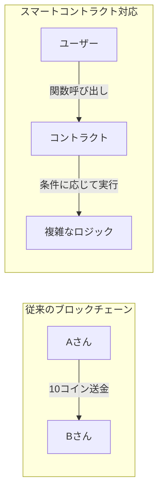
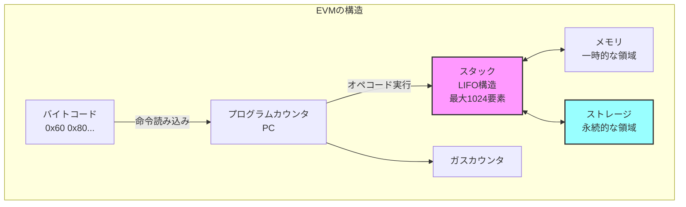

## 第9章の概要：EVM実装に向けた準備

第8章まででP2Pネットワークによるブロックチェーンの基本的な実装が完成しました。第9章では、ブロックチェーンの次の大きなステップとして、**スマートコントラクト**を実行できるEVM（Ethereum Virtual Machine）の実装に挑戦します。

しかし、EVMの完全な実装は非常に複雑で、以下のような要素が必要となります：

1. **256ビット整数演算**: EVMの基本データ型
2. **スタックマシン**: 最大1024要素のスタック
3. **メモリとストレージ**: 一時的/永続的なデータ保存
4. **オペコード実装**: 140以上の命令
5. **ガス計算**: 実行コストの管理

そのため、本書では第9章を以下の3つのパートに分けて解説します：

### 第9章-1: EVMの基礎概念とデータ構造（本章）

- EVMとは何か、なぜ必要なのか
- スタックマシンの基本概念
- 256ビット整数型の実装
- 基本的なデータ構造（スタック、メモリ、ストレージ）

### 第9章-2: 基本的なオペコードの実装

- 算術演算（ADD、MUL、SUB等）
- スタック操作（PUSH、POP、DUP、SWAP）
- メモリ操作（MSTORE、MLOAD）
- 簡単なテストプログラムの実行

### 第9章-3: スマートコントラクトの実行

- 制御フロー（JUMP、JUMPI）
- 関数呼び出し（CALLDATALOAD、RETURN）
- 実際のSolidityコントラクトの実行
- ストレージの永続化

## なぜEVMが必要なのか

これまでのブロックチェーンは「誰が誰にいくら送金したか」という単純な取引記録しか扱えませんでした。しかし、Ethereumが導入したスマートコントラクトにより、ブロックチェーン上でプログラムを実行できるようになりました。



EVMは、この「ブロックチェーン上でプログラムを実行する」ための仮想マシンです。

## EVMの基本構造

EVMは**スタックベースの仮想マシン**です。以下の主要コンポーネントで構成されています：



### 主要コンポーネントの説明

1. **スタック**: 256ビット整数を最大1024個まで格納できるLIFO（Last In First Out）構造
2. **メモリ**: プログラム実行中のみ有効な一時的なバイト配列
3. **ストレージ**: コントラクトごとに永続化される256ビットのキー・値ストア
4. **プログラムカウンタ（PC）**: 現在実行中の命令の位置
5. **ガス**: 実行にかかるコストを管理するカウンタ

## この章で実装する内容

### 1. 256ビット整数型（EVMu256）

Zigには標準で256ビット整数型がないため、独自に実装します：

```zig
/// EVM用の256ビット整数型
pub const EVMu256 = struct {
    hi: u128, // 上位128ビット
    lo: u128, // 下位128ビット

    /// ゼロ値を返す
    pub fn zero() EVMu256 {
        return EVMu256{ .hi = 0, .lo = 0 };
    }

    /// 加算
    pub fn add(self: EVMu256, other: EVMu256) EVMu256 {
        const result_lo = self.lo +% other.lo;
        const carry = if (result_lo < self.lo) 1 else 0;
        const result_hi = self.hi +% other.hi +% carry;
        return EVMu256{ .hi = result_hi, .lo = result_lo };
    }
};
```

### 2. スタックの実装

固定サイズ配列を使った効率的なスタック実装：

```zig
/// EVMスタック（最大1024要素）
pub const EvmStack = struct {
    data: [1024]EVMu256,
    top: usize,

    pub fn init() EvmStack {
        return EvmStack{
            .data = undefined,
            .top = 0,
        };
    }

    pub fn push(self: *EvmStack, value: EVMu256) !void {
        if (self.top >= 1024) return error.StackOverflow;
        self.data[self.top] = value;
        self.top += 1;
    }

    pub fn pop(self: *EvmStack) !EVMu256 {
        if (self.top == 0) return error.StackUnderflow;
        self.top -= 1;
        return self.data[self.top];
    }
};
```

### 3. メモリとストレージ

動的に拡張可能なメモリと、ハッシュマップベースのストレージ：

```zig
/// EVMメモリ（動的拡張可能）
pub const EvmMemory = struct {
    data: std.ArrayList(u8),

    pub fn store(self: *EvmMemory, offset: usize, value: EVMu256) !void {
        // オフセットに32バイトのデータを書き込む
    }
};

/// EVMストレージ（永続的なキー・値ストア）
pub const EvmStorage = struct {
    data: std.AutoHashMap(EVMu256, EVMu256),

    pub fn store(self: *EvmStorage, key: EVMu256, value: EVMu256) !void {
        try self.data.put(key, value);
    }
};
```

## 次章へ向けて

本章でEVMの基本的なデータ構造を理解し、実装しました。次章（第9章-2）では、これらのデータ構造を使って実際のオペコードを実装し、簡単な計算プログラムを実行できるようにします。

最終的に第9章-3では、実際のSolidityで書かれたスマートコントラクトをコンパイルして実行できるEVMを完成させます。

## 演習問題

1. EVMu256型に乗算（mul）メソッドを追加してみましょう
2. スタックにdup（複製）メソッドを追加してみましょう
3. メモリの読み書きを実装してみましょう

これらの演習を通じて、EVMの基本的な動作を理解し、次章への準備を整えましょう。
