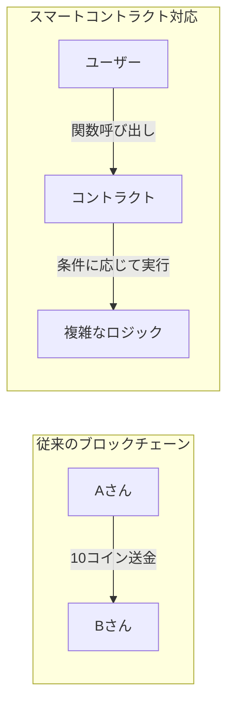
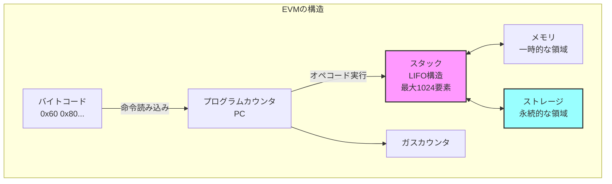

# EVMの基本概念

[← 第9章の概要](./chapter9_intro.md) | [第9章-2: データ構造の実装 →](./chapter9_datastructures.md)

## EVMとは

Ethereumブロックチェイン上でスマートコントラクトを実行するための仮想マシンです。これまでのブロックチェインは「誰が誰にいくら送金したか」という単純な取引記録しか扱えませんでした。しかし、Ethereumが導入したスマートコントラクトにより、ブロックチェイン上でプログラムを実行できるようになりました。



イーサリアムの各ノードはEVMを内部に持ち、ブロック内の取引に含まれるスマートコントラクトのコードをEVM上で実行することで、結果として世界状態（ワールドステート）を更新します。EVMは256ビット長のWord（32バイト）を基本単位とする**スタックマシン**であり、プログラム（バイトコード）を順次読み取り実行していきます。スマートコントラクトのコードは**バイトコード**（機械語に相当）でブロックチェイン上に保存され、EVMがこれを解釈・実行します。EVMは以下の主要コンポーネントで構成されています。



EVMには、実行時に使用されるいくつかの主要なデータ領域があります。[Ethereum Yellow Paper](https://ethereum.github.io/yellowpaper/paper.pdf)。

- ストレージ (Storage): 各コントラクト（アカウント）に紐づく永続的な**キー値ストア**です。256ビットのキーと値のマッピングで表現され、トランザクション間で保存されます ([スマートコントラクトの紹介](https://docs.soliditylang.org/ja/latest/introduction-to-smart-contracts.html#))。コントラクトの状態変数はこのストレージに格納され、ブロックチェイン上の状態の一部として永続化されます。ストレージへの書き込み・読み出しはガスコストが高く、他のコントラクトのストレージには直接アクセスできません。

- メモリ (Memory): コントラクト実行中のみ有効な一時的なメモリ空間です。呼び出しごとにリセットされ、バイトアドレスでアクセス可能な1次元の配列として扱われます。読み書きは基本的に32バイト幅単位で行われ、末尾に向かって拡張されます（拡張にはガスコストが伴います）。計算中の一時データや後述する戻り値の一時格納に利用されます。

- スタック (Stack): EVMの算術演算やオペコードのオペランド受け渡しに使われるLIFOスタックです。最大で1024要素の深さがあり、各要素は256ビットの値です。EVMはレジスタを持たず、全ての計算はスタック上で行われます。通常、オペコードはスタックの最上位要素（トップ）から必要な数の項目をPOPし、計算結果を再びスタックにPUSHします。スタックの深い位置に直接アクセスはできず、`DUP`（トップ16個までの要素を複製）や`SWAP`（トップと下位の一部を交換）命令で間接的に操作します。スタックオーバーフロー（積みすぎ）やスタックアンダーフローは実行失敗を招きます。

- プログラムカウンタ（PC）: 現在実行中のバイトコードの位置を指し示すものです。EVMは**命令ポインタ**であるPCを開始時に0とセットし、各オペコードの実行後に進めていきます。条件付きジャンプ命令などによりPCを書き換えることで、ループや条件分岐も実現します。

- ガス: EVM上でコードを実行する際に必要となる手数料単位です。各オペコード毎に「この命令で必要なガス量」が定められています。また、スマートコントラクトを呼び出すトランザクションには上限となるガス量（ガスリミット）が指定されます。EVMは命令のたびに消費ガスを積算し、ガスリミットを超えると**アウトオブガス**となり実行が停止（通常は巻き戻し）されます。ガスは無限ループや過度な計算を防ぐ仕組みです。

EVMの命令（オペコード）は1バイト長で表現され、例えば`0x01`はADD（加算）、`0x60`はPUSH（スタックへ即値を積む）といったように定義されています。スマートコントラクトのバイトコード実行は常にコードの先頭（PC=0）から開始され、`STOP (0x00)`命令に到達するか実行が中断されるまで、命令を順次取り出して解釈・実行していきます。PUSH系命令だけは直後のバイト列をオペランド（値）として持つため可変長ですが、その他の命令は固定1バイトで、スタックから値を取り出し結果をスタックに戻すという挙動をとります。

以上がEVMの基本的な仕組みです。Ethereumクライアント（例：GethやNethermindなど）には各々EVM実装が内蔵されていますが、全てEthereumの公式仕様（イエローペーパー）に従う必要があります。このチュートリアルでは、このEVMの一部機能をZigで再現し、簡単なスマートコントラクトのバイトコードを実行してみます。

## ZigでEVMを実装する準備

開発環境の準備をします。

**Solidityコンパイラの準備:** Solidityのスマートコントラクトをバイトコードにコンパイルできるように、Solidity公式のコマンドラインコンパイラ`solc`を用意します。Solidityの開発環境が既にある場合はsolcコマンドが使えるはずです。インストールされていない場合、Ethereum公式サイトや各種ドキュメントに従ってインストールしてください（例：macOSならHomebrewで`brew install solidity`）。

Solidityコンパイラ`solc`を使うと、Solidityコードから各種出力を得ることができます ([Using the Compiler](https://docs.soliditylang.org/en/latest/using-the-compiler.html))。バイトコード（EVMが実行するバイナリ）を取得するには、以下のように`--bin`オプションを指定します。

まず、コンパイルするSolidityコードを用意します。以下のような簡単なコントラクトを`contract/SimpleAdder.sol`というファイル名で保存します。

```solidity
// SPDX-License-Identifier: MIT
pragma solidity ^0.8.0;

contract Adder {
    function add(uint256 a, uint256 b) public pure returns (uint256) {
        return a + b;
    }
}
```

次に、コントラクトをコンパイルしてバイトコードを取得します。以下のコマンドを実行してください。

```bash
solc --bin --abi contract/SimpleAdder.sol
```

それぞれのオプションの意味は以下の通りです。

- `--bin`: バイトコードを出力します。
- `--abi`: コントラクトのABI（Application Binary Interface）を出力します。ABIはコントラクトの関数やイベントのインタフェースを定義したものです。

上記コマンドを実行すると、コンパイル結果としてバイトコードとABI（Application Binary Interface）が表示されます。バイトコードは`0x`で始まる16進数の文字列で、EVMが実行する命令列です。
ABIは、コントラクトの関数やイベントのインタフェースを定義したものです。ABIは、コントラクトの関数を呼び出す際に必要な情報を提供します。具体的には、関数名、引数の型、戻り値の型などが含まれます。
EVMアセンブリコードは、EVMが実行する命令の一覧を示しています。これにより、EVMがどのようにバイトコードを解釈しているかを理解する手助けになります。

```bash
solc --bin  --abi contract/SimpleAdder.sol

======= contract/SimpleAdder.sol:Adder =======
Binary:
608060405234801561000f575f80fd5b506101a58061001d5f395ff3fe608060405234801561000f575f80fd5b5060043610610029575f3560e01c8063771602f71461002d575b5f80fd5b610047600480360381019061004291906100a9565b61005d565b60405161005491906100f6565b60405180910390f35b5f818361006a919061013c565b905092915050565b5f80fd5b5f819050919050565b61008881610076565b8114610092575f80fd5b50565b5f813590506100a38161007f565b92915050565b5f80604083850312156100bf576100be610072565b5b5f6100cc85828601610095565b92505060206100dd85828601610095565b9150509250929050565b6100f081610076565b82525050565b5f6020820190506101095f8301846100e7565b92915050565b7f4e487b71000000000000000000000000000000000000000000000000000000005f52601160045260245ffd5b5f61014682610076565b915061015183610076565b92508282019050808211156101695761016861010f565b5b9291505056fea2646970667358221220e478f9e62b837b6d95fa3abbc3c7eb6c02d17eb28b14607d07eb892ef9992db964736f6c63430008180033
Contract JSON ABI
[{"inputs":[{"internalType":"uint256","name":"a","type":"uint256"},{"internalType":"uint256","name":"b","type":"uint256"}],"name":"add","outputs":[{"internalType":"uint256","name":"","type":"uint256"}],"stateMutability":"pure","type":"function"}]
```

`-o`オプションで出力先ディレクトリを指定すれば、コンパイル結果をファイルとして保存も可能です。

---

[← 第9章の概要](./chapter9_intro.md) | [第9章-2: データ構造の実装 →](./chapter9_datastructures.md)