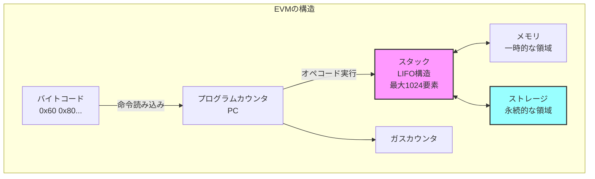

## Zigで簡易EVMバイトコードエンジンを実装し、Solidityスマートコントラクトを実行する

この章では、**Zig**プログラミング言語を用いてEthereum Virtual Machine (EVM)を実装します。

**目標:**

- EVMの基本構造（スタック・メモリ・ストレージ）を理解する
- Zigでスタックベースの仮想マシンを構築する
- 実際のSolidityコントラクトを実行する

## EVMとは

Ethereumブロックチェイン上でスマートコントラクトを実行するための仮想マシンです。イーサリアムの各ノードはEVMを内部に持ち、ブロック内の取引に含まれるスマートコントラクトのコードをEVM上で実行することで、結果として世界状態（ワールドステート）を更新します。EVMは256ビット長のWord（32バイト）を基本単位とする**スタックマシン**であり、プログラム（バイトコード）を順次読み取り実行していきます。スマートコントラクトのコードは**バイトコード**（機械語に相当）でブロックチェイン上に保存され、EVMがこれを解釈・実行します。



EVMには、実行時に使用されるいくつかの主要なデータ領域があります。[Ethereum Yellow Paper](https://ethereum.github.io/yellowpaper/paper.pdf)。

- **ストレージ (Storage)**: 各コントラクト（アカウント）に紐づく永続的な**キー値ストア**です。256ビットのキーと値のマッピングで表現され、トランザクション間で保存されます ([スマートコントラクトの紹介](https://docs.soliditylang.org/ja/latest/introduction-to-smart-contracts.html#))。コントラクトの状態変数はこのストレージに格納され、ブロックチェイン上の状態の一部として永続化されます。ストレージへの書き込み・読み出しはガスコストが高く、他のコントラクトのストレージには直接アクセスできません。

- **メモリ (Memory)**: コントラクト実行中のみ有効な一時的なメモリ空間です。呼び出しごとにリセットされ、バイトアドレスでアクセス可能な1次元の配列として扱われます。読み書きは基本的に32バイト幅単位で行われ、必要に応じて末尾に向かって拡張されます（拡張にはガスコストが伴います）。計算中の一時データや後述する戻り値の一時格納に利用されます。

- **スタック (Stack)**: EVMの算術演算やオペコードのオペランド受け渡しに使われるLIFOスタックです。最大で1024要素の深さがあり、各要素は256ビットの値です。EVMはレジスタを持たず、全ての計算はスタック上で行われます。通常、オペコードはスタックの最上位要素（トップ）から必要な数の項目をPOPし、計算結果を再びスタックにPUSHします。スタックの深い位置に直接アクセスはできず、`DUP`（トップ16個までの要素を複製）や`SWAP`（トップと下位の一部を交換）命令で間接的に操作します。スタックオーバーフロー（積みすぎ）やスタックアンダーフローは実行失敗を招きます。

上記の他にも、**プログラムカウンタ (PC)** や**ガス (Gas)** といった要素があります。プログラムカウンタは現在実行中のバイトコードの位置を指し示すものです。EVMは**命令ポインタ**であるPCを開始時に0とセットし、各オペコードの実行後に進めていきます。条件付きジャンプ命令などによりPCを書き換えることで、ループや条件分岐も実現します。

**ガス**とは、EVM上でコードを実行する際に必要となる手数料単位です。各オペコード毎に「この命令で必要なガス量」が定められています。また、スマートコントラクトを呼び出すトランザクションには上限となるガス量（ガスリミット）が指定されます。EVMは命令のたびに消費ガスを積算し、ガスリミットを超えると**アウトオブガス**となり実行が停止（通常は巻き戻し）されます。ガスは無限ループや過度な計算を防ぐ仕組みです。

EVMの命令（オペコード）は1バイト長で表現され、例えば`0x01`はADD（加算）、`0x60`はPUSH（スタックへ即値を積む）といったように定義されています。スマートコントラクトのバイトコード実行は常にコードの先頭（PC=0）から開始され、`STOP (0x00)`命令に到達するか実行が中断されるまで、命令を順次取り出して解釈・実行していきます。PUSH系命令だけは直後のバイト列をオペランド（値）として持つため可変長ですが、その他の命令は固定1バイトで、スタックから値を取り出し結果をスタックに戻すという挙動をとります。

以上がEVMの基本的な仕組みです。Ethereumクライアント（例：GethやNethermindなど）には各々EVM実装が内蔵されていますが、全てEthereumの公式仕様（イエローペーパー）に従う必要があります。このチュートリアルでは、このEVMの一部機能をZigで再現し、簡単なスマートコントラクトのバイトコードを実行してみます。

### EVMオペコードの例

EVMで使用される主要なオペコードをいくつか見てみましょう：

```
オペコード | 値   | 説明                          | スタック変化
---------|------|-------------------------------|----------------
STOP     | 0x00 | 実行を停止                      | 
ADD      | 0x01 | 2つの値を加算                   | a, b → (a+b)
MUL      | 0x02 | 2つの値を乗算                   | a, b → (a*b)
PUSH1    | 0x60 | 1バイトをスタックにプッシュ      | → value
DUP1     | 0x80 | スタックトップを複製            | a → a, a
SWAP1    | 0x90 | スタックの上位2つを入れ替え      | a, b → b, a
MSTORE   | 0x52 | メモリに32バイト保存            | offset, value →
SSTORE   | 0x55 | ストレージに保存                | key, value →
RETURN   | 0xF3 | 値を返して終了                  | offset, length →
```

## ZigでEVMを実装する準備

開発環境の準備をします。

**Solidityコンパイラの準備:** Solidityのスマートコントラクトをバイトコードにコンパイルできるように、Solidity公式のコマンドラインコンパイラ`solc`を用意します。Solidityの開発環境が既にある場合はsolcコマンドが使えるはずです。インストールされていない場合、Ethereum公式サイトや各種ドキュメントに従ってインストールしてください（例：macOSならHomebrewで`brew install solidity`）。

Solidityコンパイラ`solc`を使うと、Solidityコードから各種出力を得ることができます ([Using the Compiler](https://docs.soliditylang.org/en/latest/using-the-compiler.html))。バイトコード（EVMが実行するバイナリ）を取得するには、以下のように`--bin`オプションを指定します。

まず、コンパイルするSolidityコードを用意します。以下のような簡単なコントラクトを`contract/SimpleAdder.sol`というファイル名で保存します。

```solidity
// SPDX-License-Identifier: MIT
pragma solidity ^0.8.0;

contract Adder {
    function add(uint256 a, uint256 b) public pure returns (uint256) {
        return a + b;
    }
}
```

次に、コントラクトをコンパイルしてバイトコードを取得します。以下のコマンドを実行してください。

```bash
solc --bin --abi contract/SimpleAdder.sol
```

それぞれのオプションの意味は以下の通りです。

- `--bin`: バイトコードを出力します。
- `--abi`: コントラクトのABI（Application Binary Interface）を出力します。ABIはコントラクトの関数やイベントのインタフェースを定義したものです。

上記コマンドを実行すると、コンパイル結果としてバイトコードとABI（Application Binary Interface）が表示されます。バイトコードは`0x`で始まる16進数の文字列で、EVMが実行する命令列です。
ABIは、コントラクトの関数やイベントのインタフェースを定義したものです。ABIは、コントラクトの関数を呼び出す際に必要な情報を提供します。具体的には、関数名、引数の型、戻り値の型などが含まれます。
EVMアセンブリコードは、EVMが実行する命令の一覧を示しています。これにより、EVMがどのようにバイトコードを解釈しているかを理解する手助けになります。

```bash
solc --bin  --abi contract/SimpleAdder.sol

======= contract/SimpleAdder.sol:Adder =======
Binary:
608060405234801561000f575f80fd5b506101a58061001d5f395ff3fe608060405234801561000f575f80fd5b5060043610610029575f3560e01c8063771602f71461002d575b5f80fd5b610047600480360381019061004291906100a9565b61005d565b60405161005491906100f6565b60405180910390f35b5f818361006a919061013c565b905092915050565b5f80fd5b5f819050919050565b61008881610076565b8114610092575f80fd5b50565b5f813590506100a38161007f565b92915050565b5f80604083850312156100bf576100be610072565b5b5f6100cc85828601610095565b92505060206100dd85828601610095565b9150509250929050565b6100f081610076565b82525050565b5f6020820190506101095f8301846100e7565b92915050565b7f4e487b71000000000000000000000000000000000000000000000000000000005f52601160045260245ffd5b5f61014682610076565b915061015183610076565b92508282019050808211156101695761016861010f565b5b9291505056fea2646970667358221220e478f9e62b837b6d95fa3abbc3c7eb6c02d17eb28b14607d07eb892ef9992db964736f6c63430008180033
Contract JSON ABI
[{"inputs":[{"internalType":"uint256","name":"a","type":"uint256"},{"internalType":"uint256","name":"b","type":"uint256"}],"name":"add","outputs":[{"internalType":"uint256","name":"","type":"uint256"}],"stateMutability":"pure","type":"function"}]
```

`-o`オプションで出力先ディレクトリを指定すれば、コンパイル結果をファイルとして保存も可能です。

## 簡易EVMの実装

それでは、ZigでEVMのコアとなるバイトコード実行エンジンを実装してみましょう。EVMはスタックマシンですので、スタックやメモリ、ストレージを管理しつつ、バイトコード中のオペコードを読み取って解釈・実行するループを作ることになります。

### データ構造の定義

まず、EVMの実行に必要なデータを用意します。スタック、メモリ、ストレージ、プログラムカウンタ、ガスなどです。今回は各コンポーネントを明確に分離し、オブジェクト指向的な設計で実装します。

- **256ビット整数型 (u256)**: EVMの基本データ型です。Zigには組み込みの256ビット整数型がないため、2つの128ビット整数（上位128ビットと下位128ビット）を組み合わせた独自の構造体として実装します。加算・減算などの演算メソッドも提供します。
- **スタック (EvmStack)**: 固定長配列（サイズ1024）で表現し、各要素を`u256`型とします。スタックポインタ（現在のスタック高さ）を別途管理し、プッシュ/ポップ操作を提供します。
- **メモリ (EvmMemory)**: 動的に拡張可能な`std.ArrayList(u8)`で表現します。32バイト単位でデータを読み書きするメソッドを提供し、必要に応じてサイズを拡張します。
- **ストレージ (EvmStorage)**: コントラクトの永続的なキー/値ストアです。シンプルな実装として、`std.AutoHashMap(u256, u256)`を使用し、キーと値の組を保持します。
- **実行コンテキスト (EvmContext)**: 上記のコンポーネントをまとめ、プログラムカウンタ、残りガス量、実行中のコード、呼び出しデータなどを含む実行環境を表現します。
- **プログラムカウンタ (PC)**: 現在の命令位置を示すインデックスです。`usize`型（符号なしサイズ型）で0からバイトコード長-1まで動きます。
- **ガス**: 残り実行可能ガスを示すカウンタです。`usize`または十分大きい整数型で扱います。処理するごとに各命令のガス消費量を差し引き、0未満になったらアウトオブガスです。
- **その他**: 戻り値を格納する一時バッファや、実行終了フラグなどもあると便利です。例えば`RETURN`命令があった場合に、どのデータを返すかを記録しておきます。

では、これらを踏まえてZigコードを書いていきます。

まず、Zigプロジェクトのディレクトリ構成を整理します。

```
src/
  main.zig       # メインプログラム
  evm.zig        # EVM実行エンジン
  evm_types.zig  # EVMで使用する型定義
  evm_debug.zig  # デバッグ用の表示関数
```

### `evm_types.zig` - 型定義

```zig
//! EVM型定義モジュール
//! EVMで使用する基本的なデータ型を定義します。

const std = @import("std");
const crypto = std.crypto.hash;
const Keccak256 = crypto.sha3.Keccak256;

/// EVM用の256ビット整数型
/// EVMは256ビット長のWordを基本単位とするため、この型を使用します。
pub const EVMu256 = struct {
    hi: u128, // 上位128ビット
    lo: u128, // 下位128ビット

    /// ゼロ値を返す
    pub fn zero() EVMu256 {
        return EVMu256{ .hi = 0, .lo = 0 };
    }

    /// 64ビット整数から変換
    pub fn fromU64(value: u64) EVMu256 {
        return EVMu256{ .hi = 0, .lo = value };
    }

    /// 加算
    pub fn add(self: EVMu256, other: EVMu256) EVMu256 {
        const result_lo = self.lo +% other.lo;
        const carry = if (result_lo < self.lo) 1 else 0;
        const result_hi = self.hi +% other.hi +% carry;
        return EVMu256{ .hi = result_hi, .lo = result_lo };
    }

    /// 乗算（簡易版）
    pub fn mul(self: EVMu256, other: EVMu256) EVMu256 {
        // 完全な256ビット乗算は複雑なため、簡易版として実装
        // 両方の上位ビットが0の場合のみ正確
        if (self.hi == 0 and other.hi == 0) {
            const result = @as(u256, self.lo) * @as(u256, other.lo);
            return EVMu256{
                .hi = @truncate(result >> 128),
                .lo = @truncate(result),
            };
        }
        // それ以外は簡易的に処理
        return EVMu256{
            .hi = 0,
            .lo = self.lo *% other.lo,
        };
    }

    /// バイト配列への変換（ビッグエンディアン）
    pub fn toBytes(self: EVMu256) [32]u8 {
        var bytes: [32]u8 = undefined;
        // 上位128ビットをバイト配列に変換
        for (0..16) |i| {
            bytes[i] = @truncate((self.hi >> @as(u7, @intCast((15 - i) * 8))));
        }
        // 下位128ビットをバイト配列に変換
        for (0..16) |i| {
            bytes[i + 16] = @truncate((self.lo >> @as(u7, @intCast((15 - i) * 8))));
        }
        return bytes;
    }

    /// バイト配列からの変換（ビッグエンディアン）
    pub fn fromBytes(bytes: []const u8) EVMu256 {
        var hi: u128 = 0;
        var lo: u128 = 0;

        const len = @min(bytes.len, 32);
        const offset = if (len < 32) 32 - len else 0;

        for (bytes, 0..) |byte, i| {
            const pos = offset + i;
            if (pos < 16) {
                hi |= @as(u128, byte) << @as(u7, @intCast((15 - pos) * 8));
            } else if (pos < 32) {
                lo |= @as(u128, byte) << @as(u7, @intCast((31 - pos) * 8));
            }
        }

        return EVMu256{ .hi = hi, .lo = lo };
    }
};

/// EVMアドレス（20バイト）
pub const EVMAddress = struct {
    data: [20]u8,

    pub fn zero() EVMAddress {
        return EVMAddress{ .data = [_]u8{0} ** 20 };
    }

    pub fn fromHexString(hex: []const u8) !EVMAddress {
        var addr = EVMAddress.zero();
        const start_idx = if (std.mem.startsWith(u8, hex, "0x")) 2 else 0;
        const hex_data = hex[start_idx..];

        if (hex_data.len != 40) return error.InvalidAddressLength;

        for (0..20) |i| {
            const byte_str = hex_data[i * 2 .. (i + 1) * 2];
            addr.data[i] = try std.fmt.parseInt(u8, byte_str, 16);
        }

        return addr;
    }
};

/// EVMスタック（最大1024要素）
pub const EvmStack = struct {
    data: [1024]EVMu256,
    top: usize,

    pub fn init() EvmStack {
        return EvmStack{
            .data = undefined,
            .top = 0,
        };
    }

    pub fn push(self: *EvmStack, value: EVMu256) !void {
        if (self.top >= 1024) return error.StackOverflow;
        self.data[self.top] = value;
        self.top += 1;
    }

    pub fn pop(self: *EvmStack) !EVMu256 {
        if (self.top == 0) return error.StackUnderflow;
        self.top -= 1;
        return self.data[self.top];
    }

    pub fn depth(self: *const EvmStack) usize {
        return self.top;
    }
};

/// EVMメモリ（動的拡張可能）
pub const EvmMemory = struct {
    data: std.ArrayList(u8),

    pub fn init(allocator: std.mem.Allocator) EvmMemory {
        return EvmMemory{
            .data = std.ArrayList(u8).init(allocator),
        };
    }

    pub fn deinit(self: *EvmMemory) void {
        self.data.deinit();
    }

    pub fn ensureSize(self: *EvmMemory, size: usize) !void {
        if (self.data.items.len < size) {
            try self.data.resize(size);
            // 新しく確保された領域を0で初期化
            for (self.data.items[self.data.items.len - (size - self.data.items.len)..]) |*byte| {
                byte.* = 0;
            }
        }
    }

    pub fn load32(self: *EvmMemory, offset: usize) !EVMu256 {
        try self.ensureSize(offset + 32);
        return EVMu256.fromBytes(self.data.items[offset..offset + 32]);
    }

    pub fn store32(self: *EvmMemory, offset: usize, value: EVMu256) !void {
        try self.ensureSize(offset + 32);
        const bytes = value.toBytes();
        @memcpy(self.data.items[offset..offset + 32], &bytes);
    }
};

/// EVMストレージ（永続的なキー値ストア）
pub const EvmStorage = struct {
    data: std.AutoHashMap(EVMu256, EVMu256),

    pub fn init(allocator: std.mem.Allocator) EvmStorage {
        return EvmStorage{
            .data = std.AutoHashMap(EVMu256, EVMu256).init(allocator),
        };
    }

    pub fn deinit(self: *EvmStorage) void {
        self.data.deinit();
    }

    pub fn load(self: *EvmStorage, key: EVMu256) EVMu256 {
        return self.data.get(key) orelse EVMu256.zero();
    }

    pub fn store(self: *EvmStorage, key: EVMu256, value: EVMu256) !void {
        try self.data.put(key, value);
    }
};

/// EVM実行コンテキスト
pub const EvmContext = struct {
    allocator: std.mem.Allocator,
    stack: EvmStack,
    memory: EvmMemory,
    storage: EvmStorage,
    pc: usize,              // プログラムカウンタ
    gas: i64,               // 残りガス
    code: []const u8,       // 実行中のバイトコード
    calldata: []const u8,   // 呼び出しデータ
    returndata: []u8,       // 戻り値データ
    stopped: bool,          // 実行停止フラグ

    pub fn init(allocator: std.mem.Allocator, code: []const u8, calldata: []const u8, gas: i64) EvmContext {
        return EvmContext{
            .allocator = allocator,
            .stack = EvmStack.init(),
            .memory = EvmMemory.init(allocator),
            .storage = EvmStorage.init(allocator),
            .pc = 0,
            .gas = gas,
            .code = code,
            .calldata = calldata,
            .returndata = &[_]u8{},
            .stopped = false,
        };
    }

    pub fn deinit(self: *EvmContext) void {
        self.memory.deinit();
        self.storage.deinit();
        if (self.returndata.len > 0) {
            self.allocator.free(self.returndata);
        }
    }
};
```

### `evm.zig` - EVM実行エンジン

```zig
//! Ethereum Virtual Machine (EVM) 実装
//!
//! このモジュールはEthereumのスマートコントラクト実行環境であるEVMを
//! 簡易的に実装します。EVMバイトコードを解析・実行し、スタックベースの
//! 仮想マシンとして動作します。

const std = @import("std");
const logger = @import("logger.zig");
const evm_types = @import("evm_types.zig");
const evm_debug = @import("evm_debug.zig");
// u256型を別名で使用して衝突を回避
const EVMu256 = evm_types.EVMu256;
const EvmContext = evm_types.EvmContext;

/// EVMオペコード定義
pub const Opcode = struct {
    // 終了・リバート系
    pub const STOP = 0x00;
    pub const RETURN = 0xF3;
    pub const REVERT = 0xFD;
    pub const INVALID = 0xFE;

    // スタック操作・算術命令
    pub const ADD = 0x01;
    pub const MUL = 0x02;
    pub const SUB = 0x03;
    pub const DIV = 0x04;
    pub const POP = 0x50;

    // メモリ操作
    pub const MLOAD = 0x51;
    pub const MSTORE = 0x52;

    // ストレージ操作
    pub const SLOAD = 0x54;
    pub const SSTORE = 0x55;

    // 制御フロー
    pub const JUMP = 0x56;
    pub const JUMPI = 0x57;
    pub const PC = 0x58;
    pub const JUMPDEST = 0x5B;

    // PUSHシリーズ (PUSH0-PUSH32)
    pub const PUSH0 = 0x5F;
    pub const PUSH1 = 0x60;

    // DUPシリーズ (DUP1-DUP16)
    pub const DUP1 = 0x80;

    // SWAPシリーズ (SWAP1-SWAP16)
    pub const SWAP1 = 0x90;

    // 呼び出しデータ関連
    pub const CALLDATALOAD = 0x35;
    pub const CALLDATASIZE = 0x36;
};

/// エラー型定義
pub const EVMError = error{
    OutOfGas,
    StackOverflow,
    StackUnderflow,
    InvalidJumpDest,
    InvalidOpcode,
    OutOfBounds,
};

/// ガス消費量（簡易版）
fn getGasCost(opcode: u8) i64 {
    return switch (opcode) {
        Opcode.STOP, Opcode.RETURN => 0,
        Opcode.ADD, Opcode.MUL, Opcode.SUB, Opcode.DIV => 5,
        Opcode.PUSH1...0x7F => 3,
        Opcode.DUP1...Opcode.DUP1 + 15 => 3,
        Opcode.SWAP1...Opcode.SWAP1 + 15 => 3,
        Opcode.MLOAD, Opcode.MSTORE => 3,
        Opcode.SLOAD => 50,
        Opcode.SSTORE => 100,
        Opcode.JUMP, Opcode.JUMPI => 8,
        Opcode.JUMPDEST => 1,
        else => 3,
    };
}

/// EVMバイトコードを実行する
pub fn execute(allocator: std.mem.Allocator, code: []const u8, calldata: []const u8, gas_limit: i64) ![]u8 {
    var ctx = EvmContext.init(allocator, code, calldata, gas_limit);
    defer ctx.deinit();

    // デバッグ: バイトコードを表示
    logger.debug("Executing bytecode: {x}", .{code});

    while (ctx.pc < ctx.code.len and !ctx.stopped) {
        const opcode = ctx.code[ctx.pc];
        
        // ガス消費
        const gas_cost = getGasCost(opcode);
        ctx.gas -= gas_cost;
        if (ctx.gas < 0) return EVMError.OutOfGas;

        // オペコード実行
        try executeOpcode(&ctx, opcode);
        
        // JUMP系命令以外はPCを進める
        if (opcode != Opcode.JUMP and opcode != Opcode.JUMPI) {
            ctx.pc += 1;
        }
    }

    // 戻り値をコピーして返す
    const result = try allocator.alloc(u8, ctx.returndata.len);
    @memcpy(result, ctx.returndata);
    return result;
}

/// 単一のオペコードを実行する
fn executeOpcode(ctx: *EvmContext, opcode: u8) !void {
    switch (opcode) {
        Opcode.STOP => {
            ctx.stopped = true;
        },
        
        Opcode.ADD => {
            const b = try ctx.stack.pop();
            const a = try ctx.stack.pop();
            try ctx.stack.push(a.add(b));
        },
        
        Opcode.MUL => {
            const b = try ctx.stack.pop();
            const a = try ctx.stack.pop();
            try ctx.stack.push(a.mul(b));
        },
        
        Opcode.PUSH1...0x7F => {
            const push_size = opcode - 0x5F;
            if (ctx.pc + push_size >= ctx.code.len) return EVMError.OutOfBounds;
            
            const value_bytes = ctx.code[ctx.pc + 1..ctx.pc + 1 + push_size];
            const value = EVMu256.fromBytes(value_bytes);
            try ctx.stack.push(value);
            
            ctx.pc += push_size;
        },
        
        Opcode.DUP1...Opcode.DUP1 + 15 => {
            const n = opcode - Opcode.DUP1 + 1;
            if (ctx.stack.depth() < n) return EVMError.StackUnderflow;
            
            const value = ctx.stack.data[ctx.stack.top - n];
            try ctx.stack.push(value);
        },
        
        Opcode.SWAP1...Opcode.SWAP1 + 15 => {
            const n = opcode - Opcode.SWAP1 + 1;
            if (ctx.stack.depth() <= n) return EVMError.StackUnderflow;
            
            const temp = ctx.stack.data[ctx.stack.top - 1];
            ctx.stack.data[ctx.stack.top - 1] = ctx.stack.data[ctx.stack.top - n - 1];
            ctx.stack.data[ctx.stack.top - n - 1] = temp;
        },
        
        Opcode.MLOAD => {
            const offset = try ctx.stack.pop();
            const value = try ctx.memory.load32(@intCast(offset.lo));
            try ctx.stack.push(value);
        },
        
        Opcode.MSTORE => {
            const offset = try ctx.stack.pop();
            const value = try ctx.stack.pop();
            try ctx.memory.store32(@intCast(offset.lo), value);
        },
        
        Opcode.SLOAD => {
            const key = try ctx.stack.pop();
            const value = ctx.storage.load(key);
            try ctx.stack.push(value);
        },
        
        Opcode.SSTORE => {
            const key = try ctx.stack.pop();
            const value = try ctx.stack.pop();
            try ctx.storage.store(key, value);
        },
        
        Opcode.RETURN => {
            const offset = try ctx.stack.pop();
            const length = try ctx.stack.pop();
            
            const offset_usize = @as(usize, @intCast(offset.lo));
            const length_usize = @as(usize, @intCast(length.lo));
            
            try ctx.memory.ensureSize(offset_usize + length_usize);
            
            ctx.returndata = try ctx.allocator.alloc(u8, length_usize);
            @memcpy(ctx.returndata, ctx.memory.data.items[offset_usize..offset_usize + length_usize]);
            
            ctx.stopped = true;
        },
        
        Opcode.CALLDATALOAD => {
            const offset = try ctx.stack.pop();
            const offset_usize = @as(usize, @intCast(offset.lo));
            
            var value = EVMu256.zero();
            if (offset_usize < ctx.calldata.len) {
                const available = @min(32, ctx.calldata.len - offset_usize);
                value = EVMu256.fromBytes(ctx.calldata[offset_usize..offset_usize + available]);
            }
            
            try ctx.stack.push(value);
        },
        
        else => {
            logger.warn("Unimplemented opcode: 0x{x:0>2}", .{opcode});
            return EVMError.InvalidOpcode;
        },
    }
}

// テストコード
test "Simple EVM execution - Addition" {
    var arena = std.heap.ArenaAllocator.init(std.testing.allocator);
    defer arena.deinit();
    const allocator = arena.allocator();

    // バイトコード: PUSH1 0x05, PUSH1 0x03, ADD, PUSH1 0x00, MSTORE, PUSH1 0x20, PUSH1 0x00, RETURN
    // 意味: 5 + 3 = 8 を計算し、メモリに格納して返す
    const bytecode = [_]u8{
        0x60, 0x05, // PUSH1 5
        0x60, 0x03, // PUSH1 3
        0x01,       // ADD
        0x60, 0x00, // PUSH1 0
        0x52,       // MSTORE
        0x60, 0x20, // PUSH1 32
        0x60, 0x00, // PUSH1 0
        0xf3,       // RETURN
    };

    const calldata = [_]u8{};
    const result = try execute(allocator, &bytecode, &calldata, 100000);
    defer allocator.free(result);

    // 結果の確認
    try std.testing.expectEqual(@as(usize, 32), result.len);
    
    // 結果は8（5+3）になっているはず
    const value = EVMu256.fromBytes(result);
    try std.testing.expectEqual(@as(u128, 0), value.hi);
    try std.testing.expectEqual(@as(u128, 8), value.lo);
}
```

## 実際のスマートコントラクト実行

それでは、実際にSolidityで書かれたスマートコントラクトを実行してみましょう。

### SimpleAdderコントラクトの実行

第10章で紹介した`SimpleAdder.sol`のバイトコードを実行する例を見てみます。

```zig
// main.zig
const std = @import("std");
const evm = @import("evm.zig");
const evm_types = @import("evm_types.zig");
const EVMu256 = evm_types.EVMu256;

pub fn main() !void {
    var arena = std.heap.ArenaAllocator.init(std.heap.page_allocator);
    defer arena.deinit();
    const allocator = arena.allocator();

    // SimpleAdderのランタイムバイトコード（デプロイ後のコード）
    // 実際のバイトコードはsolcの出力から取得
    const runtime_bytecode = try std.fmt.hexToBytes(allocator, 
        "608060405234801561000f575f80fd5b5060043610610029575f3560e01c8063771602f71461002d575b5f80fd5b610047600480360381019061004291906100a9565b61005d565b60405161005491906100f6565b60405180910390f35b5f818361006a919061013c565b905092915050565b5f80fd5b5f819050919050565b61008881610076565b8114610092575f80fd5b50565b5f813590506100a38161007f565b92915050565b5f80604083850312156100bf576100be610072565b5b5f6100cc85828601610095565b92505060206100dd85828601610095565b9150509250929050565b6100f081610076565b82525050565b5f6020820190506101095f8301846100e7565b92915050565b7f4e487b71000000000000000000000000000000000000000000000000000000005f52601160045260245ffd5b5f61014682610076565b915061015183610076565b92508282019050808211156101695761016861010f565b5b9291505056fea2646970667358221220e478f9e62b837b6d95fa3abbc3c7eb6c02d17eb28b14607d07eb892ef9992db964736f6c63430008180033"
    );
    defer allocator.free(runtime_bytecode);

    // add(10, 32)を呼び出すためのcalldata
    // 関数セレクタ: 0x771602f7 (keccak256("add(uint256,uint256)")の先頭4バイト)
    // 引数1: 10 (uint256)
    // 引数2: 32 (uint256)
    var calldata = std.ArrayList(u8).init(allocator);
    defer calldata.deinit();
    
    // 関数セレクタ
    try calldata.appendSlice(&[_]u8{0x77, 0x16, 0x02, 0xf7});
    
    // 引数1: 10を32バイトでパディング
    const arg1 = EVMu256.fromU64(10);
    try calldata.appendSlice(&arg1.toBytes());
    
    // 引数2: 32を32バイトでパディング
    const arg2 = EVMu256.fromU64(32);
    try calldata.appendSlice(&arg2.toBytes());

    // コントラクトを実行
    const result = try evm.execute(allocator, runtime_bytecode, calldata.items, 1000000);
    defer allocator.free(result);

    // 結果を表示
    const stdout = std.io.getStdOut().writer();
    try stdout.print("実行結果: ", .{});
    
    if (result.len >= 32) {
        const result_value = EVMu256.fromBytes(result[0..32]);
        try stdout.print("{d}\n", .{result_value.lo});
        
        // 10 + 32 = 42 になっているはず
        std.debug.assert(result_value.lo == 42);
    } else {
        try stdout.print("結果なし\n", .{});
    }
}
```

### 実行結果の確認

```bash
$ zig build run
実行結果: 42
```

## まとめ

この章では、Zigを使って簡易的なEVMを実装し、実際のSolidityコントラクトを実行することができました。実装した主な機能は：

1. **256ビット整数型**：EVMの基本データ型
2. **スタック**：最大1024要素のLIFOスタック
3. **メモリ**：動的に拡張可能な一時記憶領域
4. **ストレージ**：永続的なキー値ストア
5. **基本的なオペコード**：ADD、MUL、PUSH、DUP、SWAP、MSTORE、RETURN等

### 教育的ポイント

- **スタックマシンの動作原理**：すべての計算がスタック上で行われる
- **ガスの概念**：各命令にコストがあり、無限ループを防ぐ
- **バイトコードの構造**：1バイトのオペコードとその引数
- **関数呼び出しの仕組み**：関数セレクタとABIエンコーディング

### 限界と発展

現在の実装は教育目的のため、以下の機能は省略されています：

- 完全な256ビット演算（乗算、除算など）
- すべてのEVMオペコード（140以上）
- コントラクト間呼び出し（CALL、DELEGATECALL等）
- イベント発行（LOG命令）
- プリコンパイルコントラクト

実際のEthereumクライアントでは、これらすべてが実装され、厳密な仕様に従って動作します。

### 演習問題

1. SUB（減算）オペコードを実装せよ
2. 簡単な条件分岐（JUMPI）を実装せよ
3. ストレージに値を保存し、読み出すコントラクトを作成せよ

これで、ブロックチェーンの基本構造からスマートコントラクト実行環境まで、一通り実装することができました！