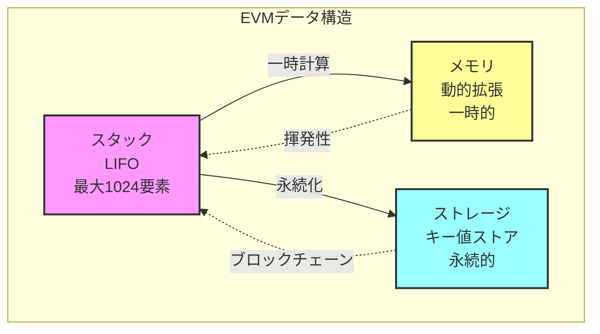
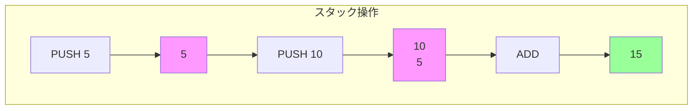

## データ構造の実装

## EVMの主要データ構造

前章で実装した`EVMu256`型を使用して、EVMの主要なデータ構造を実装します。EVMは以下の3つの主要なデータ領域を持ちます。

1. スタック: 算術演算とオペランド受け渡しに使用
2. メモリ: 一時的なデータ保存領域
3. ストレージ: 永続的なデータ保存領域



## スタックの実装

### スタックとは

EVMのスタックはLIFO（Last In, First Out）構造で、最後に積んだ値が最初に取り出されます。



### スタックの特徴

- 最大1024要素まで格納可能
- 各要素は256ビット（`EVMu256`型）
- スタックオーバーフロー・アンダーフローのチェックが必要

### 実装コード

```zig
/// EVMスタック（1024要素まで格納可能）
pub const EvmStack = struct {
    /// スタックデータ（最大1024要素）
    data: [1024]EVMu256,
    /// スタックポインタ（次に積むインデックス）
    sp: usize,

    /// 新しい空のスタックを作成
    pub fn init() EvmStack {
        return EvmStack{
            .data = undefined,
            .sp = 0,
        };
    }

    /// スタックに値をプッシュ
    pub fn push(self: *EvmStack, value: EVMu256) !void {
        if (self.sp >= 1024) {
            return error.StackOverflow;
        }
        self.data[self.sp] = value;
        self.sp += 1;
    }

    /// スタックから値をポップ
    pub fn pop(self: *EvmStack) !EVMu256 {
        if (self.sp == 0) {
            return error.StackUnderflow;
        }
        self.sp -= 1;
        return self.data[self.sp];
    }

    /// スタックの深さを取得
    pub fn depth(self: *const EvmStack) usize {
        return self.sp;
    }
};
```

### スタックの使用例

```zig
var stack = EvmStack.init();

// 値をプッシュ
try stack.push(EVMu256.fromU64(5));
try stack.push(EVMu256.fromU64(10));

// スタックの深さを確認
std.debug.print("スタック深さ: {}\n", .{stack.depth()}); // 2

// 値をポップ
const b = try stack.pop(); // 10
const a = try stack.pop(); // 5

// 加算してプッシュ
const sum = a.add(b);
try stack.push(sum); // 15
```

## メモリの実装

### メモリとは

EVMのメモリは一時的なバイト配列で、コントラクト実行中のみ有効です。

特徴。

- バイトアドレスでアクセス可能
- 32バイト（256ビット）単位で読み書き
- 必要に応じて動的に拡張
- 呼び出しごとにリセット

### 実装コード

```zig
/// EVMメモリ（動的に拡張可能なバイト配列）
pub const EvmMemory = struct {
    /// メモリデータ
    data: std.ArrayList(u8),

    /// 新しいEVMメモリを初期化
    pub fn init(allocator: std.mem.Allocator) EvmMemory {
        const memory = std.ArrayList(u8).init(allocator);
        return EvmMemory{
            .data = memory,
        };
    }

    /// メモリを必要に応じて拡張
    pub fn ensureSize(self: *EvmMemory, size: usize) !void {
        if (size > self.data.items.len) {
            // 拡張前の長さを保持
            const old_len = self.data.items.len;
            // サイズを32バイト単位に切り上げて拡張
            const new_size = ((size + 31) / 32) * 32;
            try self.data.resize(new_size);
            // 新しく確保した部分を0で初期化
            var i: usize = old_len;
            while (i < new_size) : (i += 1) {
                self.data.items[i] = 0;
            }
        }
    }

    /// メモリから32バイト（256ビット）読み込み
    pub fn load32(self: *EvmMemory, offset: usize) !EVMu256 {
        try self.ensureSize(offset + 32);
        var result = EVMu256.zero();

        // 上位128ビット（先頭16バイト）
        var hi: u128 = 0;
        for (0..16) |i| {
            const byte_val = self.data.items[offset + i];
            const shift_amount = (15 - i) * 8;
            hi |= @as(u128, byte_val) << @intCast(shift_amount);
        }

        // 下位128ビット（後半16バイト）
        var lo: u128 = 0;
        for (0..16) |i| {
            const byte_val = self.data.items[offset + 16 + i];
            const shift_amount = (15 - i) * 8;
            lo |= @as(u128, byte_val) << @intCast(shift_amount);
        }

        result.hi = hi;
        result.lo = lo;
        return result;
    }

    /// メモリに32バイト（256ビット）書き込み
    pub fn store32(self: *EvmMemory, offset: usize, value: EVMu256) !void {
        try self.ensureSize(offset + 32);

        // 上位128ビットをバイト単位で書き込み
        const hi = value.hi;
        var i: usize = 0;
        while (i < 16) : (i += 1) {
            const shift_amount = (15 - i) * 8;
            const byte_val = @as(u8, @truncate(hi >> @intCast(shift_amount)));
            self.data.items[offset + i] = byte_val;
        }

        // 下位128ビットをバイト単位で書き込み
        const lo = value.lo;
        i = 0;
        while (i < 16) : (i += 1) {
            const shift_amount = (15 - i) * 8;
            const byte_val = @as(u8, @truncate(lo >> @intCast(shift_amount)));
            self.data.items[offset + 16 + i] = byte_val;
        }
    }

    /// 解放処理
    pub fn deinit(self: *EvmMemory) void {
        self.data.deinit();
    }
};
```

### メモリの使用例

```zig
const allocator = std.heap.page_allocator;
var memory = EvmMemory.init(allocator);
defer memory.deinit();

// オフセット0に値を書き込み
const value = EVMu256.fromU64(42);
try memory.store32(0, value);

// オフセット0から値を読み込み
const loaded = try memory.load32(0);
std.debug.print("読み込んだ値: {}\n", .{loaded.lo}); // 42
```

### メモリ拡張の仕組み

メモリは32バイト単位で動的に拡張されます。

```text
初期状態: []
offset=0に書き込み → [32バイト]
offset=64に書き込み → [32バイト][32バイト][32バイト]（96バイト）
                      ↑        ↑        ↑
                   0-31    32-63    64-95
```

## ストレージの実装

### ストレージとは

EVMのストレージは永続的なキー値ストアで、ブロックチェーン上に保存されます。

特徴。

- 256ビットのキーと値のマッピング
- トランザクション間で保持
- ガスコストが高い
- コントラクトの状態変数を格納

### 実装コード

```zig
/// EVMストレージ（永続的なキー/バリューストア）
pub const EvmStorage = struct {
    /// ストレージデータ（キー: EVMu256, 値: EVMu256のマップ）
    data: std.AutoHashMap(EVMu256, EVMu256),

    /// 新しいストレージを初期化
    pub fn init(allocator: std.mem.Allocator) EvmStorage {
        return EvmStorage{
            .data = std.AutoHashMap(EVMu256, EVMu256).init(allocator),
        };
    }

    /// ストレージから値を読み込み
    pub fn load(self: *EvmStorage, key: EVMu256) EVMu256 {
        return self.data.get(key) orelse EVMu256.zero();
    }

    /// ストレージに値を書き込み
    pub fn store(self: *EvmStorage, key: EVMu256, value: EVMu256) !void {
        try self.data.put(key, value);
    }

    /// 解放処理
    pub fn deinit(self: *EvmStorage) void {
        self.data.deinit();
    }
};
```

### ストレージの使用例

```zig
const allocator = std.heap.page_allocator;
var storage = EvmStorage.init(allocator);
defer storage.deinit();

// キー1に値100を保存
const key = EVMu256.fromU64(1);
const value = EVMu256.fromU64(100);
try storage.store(key, value);

// キー1から値を読み込み
const loaded = storage.load(key);
std.debug.print("読み込んだ値: {}\n", .{loaded.lo}); // 100

// 存在しないキーは0を返す
const not_found = storage.load(EVMu256.fromU64(999));
std.debug.print("未登録キー: {}\n", .{not_found.lo}); // 0
```

## EVMコンテキストの実装

### EVMコンテキストとは

これまで実装したスタック、メモリ、ストレージをまとめた実行環境です。

```zig
/// EVM実行コンテキスト（実行状態を保持）
pub const EvmContext = struct {
    /// プログラムカウンタ（現在実行中のコード位置）
    pc: usize,
    /// 残りガス量
    gas: usize,
    /// 実行中のバイトコード
    code: []const u8,
    /// 呼び出しデータ（コントラクト呼び出し時の引数）
    calldata: []const u8,
    /// 戻り値データ
    returndata: std.ArrayList(u8),
    /// スタック
    stack: EvmStack,
    /// メモリ
    memory: EvmMemory,
    /// ストレージ
    storage: EvmStorage,
    /// 呼び出し深度（再帰呼び出し用）
    depth: u8,
    /// 実行終了フラグ
    stopped: bool,
    /// エラー発生時のメッセージ
    error_msg: ?[]const u8,

    /// 新しいEVM実行コンテキストを初期化
    pub fn init(allocator: std.mem.Allocator, code: []const u8, calldata: []const u8) EvmContext {
        return EvmContext{
            .pc = 0,
            .gas = 10_000_000, // 初期ガス量
            .code = code,
            .calldata = calldata,
            .returndata = std.ArrayList(u8).init(allocator),
            .stack = EvmStack.init(),
            .memory = EvmMemory.init(allocator),
            .storage = EvmStorage.init(allocator),
            .depth = 0,
            .stopped = false,
            .error_msg = null,
        };
    }

    /// リソース解放
    pub fn deinit(self: *EvmContext) void {
        self.returndata.deinit();
        self.memory.deinit();
        self.storage.deinit();
    }
};
```

### EVMコンテキストの使用例

```zig
const allocator = std.heap.page_allocator;

// サンプルバイトコード（PUSH1 1, PUSH1 2, ADD）
const code = [_]u8{ 0x60, 0x01, 0x60, 0x02, 0x01 };
const calldata = [_]u8{};

var context = EvmContext.init(allocator, &code, &calldata);
defer context.deinit();

// スタックに値をプッシュ
try context.stack.push(EVMu256.fromU64(10));
try context.stack.push(EVMu256.fromU64(20));

// メモリに書き込み
try context.memory.store32(0, EVMu256.fromU64(42));

// ストレージに保存
try context.storage.store(EVMu256.fromU64(1), EVMu256.fromU64(100));
```

## テストコード

実装したデータ構造が正しく動作するか確認しましょう。

```zig
test "EvmStack operations" {
    var stack = EvmStack.init();
    try std.testing.expectEqual(@as(usize, 0), stack.depth());

    // プッシュテスト
    try stack.push(EVMu256.fromU64(10));
    try std.testing.expectEqual(@as(usize, 1), stack.depth());

    try stack.push(EVMu256.fromU64(20));
    try std.testing.expectEqual(@as(usize, 2), stack.depth());

    // ポップテスト
    const val1 = try stack.pop();
    try std.testing.expectEqual(@as(u64, 20), val1.lo);

    const val2 = try stack.pop();
    try std.testing.expectEqual(@as(u64, 10), val2.lo);

    // アンダーフローテスト
    try std.testing.expectError(error.StackUnderflow, stack.pop());

    // オーバーフローテスト
    for (0..1024) |i| {
        try stack.push(EVMu256.fromU64(@intCast(i)));
    }
    try std.testing.expectError(error.StackOverflow, stack.push(EVMu256.fromU64(1025)));
}

test "EvmMemory operations" {
    var arena = std.heap.ArenaAllocator.init(std.testing.allocator);
    defer arena.deinit();
    const allocator = arena.allocator();

    var memory = EvmMemory.init(allocator);
    defer memory.deinit();

    // メモリ書き込みテスト
    const value = EVMu256.fromU64(42);
    try memory.store32(0, value);

    // メモリ読み込みテスト
    const loaded = try memory.load32(0);
    try std.testing.expect(loaded.eql(value));

    // メモリ拡張テスト
    _ = try memory.load32(100);
    try std.testing.expect(memory.data.items.len >= 132);
}

test "EvmStorage operations" {
    var arena = std.heap.ArenaAllocator.init(std.testing.allocator);
    defer arena.deinit();
    const allocator = arena.allocator();

    var storage = EvmStorage.init(allocator);
    defer storage.deinit();

    // ストレージ書き込みテスト
    const key = EVMu256.fromU64(1);
    const value = EVMu256.fromU64(100);
    try storage.store(key, value);

    // ストレージ読み込みテスト
    const loaded = storage.load(key);
    try std.testing.expect(loaded.eql(value));

    // 未登録キーは0を返す
    const not_found = storage.load(EVMu256.fromU64(999));
    try std.testing.expect(not_found.eql(EVMu256.zero()));
}
```

## 最終的に出来上がったもの

ここまでの内容を統合した`evm_types.zig`の完全版です。

```zig
//! EVMデータ構造定義
//!
//! このモジュールはEthereum Virtual Machine (EVM)の実行に必要な
//! データ構造を定義します。スマートコントラクト実行環境に
//! 必要なスタック、メモリ、ストレージなどの構造体を含みます。

const std = @import("std");

/// 256ビット整数型（EVMの基本データ型）
/// 現在はu128の2つの要素で256ビットを表現
pub const EVMu256 = struct {
    // 256ビットを2つのu128値で表現（上位ビットと下位ビット）
    hi: u128, // 上位128ビット
    lo: u128, // 下位128ビット

    /// ゼロ値の作成
    pub fn zero() EVMu256 {
        return EVMu256{ .hi = 0, .lo = 0 };
    }

    /// u64値からEVMu256を作成
    pub fn fromU64(value: u64) EVMu256 {
        return EVMu256{ .hi = 0, .lo = value };
    }

    /// 加算演算
    pub fn add(self: EVMu256, other: EVMu256) EVMu256 {
        var result = EVMu256{ .hi = self.hi, .lo = self.lo };
        var overflow: u1 = 0;
        result.lo, overflow = @addWithOverflow(result.lo, other.lo);
        result.hi = result.hi + other.hi + overflow;
        return result;
    }

    /// 減算演算
    pub fn sub(self: EVMu256, other: EVMu256) EVMu256 {
        var result = EVMu256{ .hi = self.hi, .lo = self.lo };
        var underflow: u1 = 0;
        result.lo, underflow = @subWithOverflow(result.lo, other.lo);
        result.hi = result.hi - other.hi - underflow;
        return result;
    }

    /// 乗算演算（シンプル実装）
    pub fn mul(self: EVMu256, other: EVMu256) EVMu256 {
        if (self.hi == 0 and other.hi == 0) {
            const result_lo = self.lo * other.lo;
            const result_hi = @as(u128, 0);
            return EVMu256{ .hi = result_hi, .lo = result_lo };
        } else {
            return EVMu256{ .hi = 0, .lo = 0 };
        }
    }

    /// 等価比較
    pub fn eql(self: EVMu256, other: EVMu256) bool {
        return self.hi == other.hi and self.lo == other.lo;
    }
};

/// EVMスタック（1024要素まで格納可能）
pub const EvmStack = struct {
    /// スタックデータ（最大1024要素）
    data: [1024]EVMu256,
    /// スタックポインタ（次に積むインデックス）
    sp: usize,

    /// 新しい空のスタックを作成
    pub fn init() EvmStack {
        return EvmStack{
            .data = undefined,
            .sp = 0,
        };
    }

    /// スタックに値をプッシュ
    pub fn push(self: *EvmStack, value: EVMu256) !void {
        if (self.sp >= 1024) {
            return error.StackOverflow;
        }
        self.data[self.sp] = value;
        self.sp += 1;
    }

    /// スタックから値をポップ
    pub fn pop(self: *EvmStack) !EVMu256 {
        if (self.sp == 0) {
            return error.StackUnderflow;
        }
        self.sp -= 1;
        return self.data[self.sp];
    }

    /// スタックの深さを取得
    pub fn depth(self: *const EvmStack) usize {
        return self.sp;
    }
};

/// EVMメモリ（動的に拡張可能なバイト配列）
pub const EvmMemory = struct {
    /// メモリデータ
    data: std.ArrayList(u8),

    /// 新しいEVMメモリを初期化
    pub fn init(allocator: std.mem.Allocator) EvmMemory {
        const memory = std.ArrayList(u8).init(allocator);
        return EvmMemory{
            .data = memory,
        };
    }

    /// メモリを必要に応じて拡張
    pub fn ensureSize(self: *EvmMemory, size: usize) !void {
        if (size > self.data.items.len) {
            const old_len = self.data.items.len;
            const new_size = ((size + 31) / 32) * 32;
            try self.data.resize(new_size);
            var i: usize = old_len;
            while (i < new_size) : (i += 1) {
                self.data.items[i] = 0;
            }
        }
    }

    /// メモリから32バイト（256ビット）読み込み
    pub fn load32(self: *EvmMemory, offset: usize) !EVMu256 {
        try self.ensureSize(offset + 32);
        var result = EVMu256.zero();

        var hi: u128 = 0;
        for (0..16) |i| {
            const byte_val = self.data.items[offset + i];
            const shift_amount = (15 - i) * 8;
            hi |= @as(u128, byte_val) << @intCast(shift_amount);
        }

        var lo: u128 = 0;
        for (0..16) |i| {
            const byte_val = self.data.items[offset + 16 + i];
            const shift_amount = (15 - i) * 8;
            lo |= @as(u128, byte_val) << @intCast(shift_amount);
        }

        result.hi = hi;
        result.lo = lo;
        return result;
    }

    /// メモリに32バイト（256ビット）書き込み
    pub fn store32(self: *EvmMemory, offset: usize, value: EVMu256) !void {
        try self.ensureSize(offset + 32);

        const hi = value.hi;
        var i: usize = 0;
        while (i < 16) : (i += 1) {
            const shift_amount = (15 - i) * 8;
            const byte_val = @as(u8, @truncate(hi >> @intCast(shift_amount)));
            self.data.items[offset + i] = byte_val;
        }

        const lo = value.lo;
        i = 0;
        while (i < 16) : (i += 1) {
            const shift_amount = (15 - i) * 8;
            const byte_val = @as(u8, @truncate(lo >> @intCast(shift_amount)));
            self.data.items[offset + 16 + i] = byte_val;
        }
    }

    /// 解放処理
    pub fn deinit(self: *EvmMemory) void {
        self.data.deinit();
    }
};

/// EVMストレージ（永続的なキー/バリューストア）
pub const EvmStorage = struct {
    /// ストレージデータ（キー: EVMu256, 値: EVMu256のマップ）
    data: std.AutoHashMap(EVMu256, EVMu256),

    /// 新しいストレージを初期化
    pub fn init(allocator: std.mem.Allocator) EvmStorage {
        return EvmStorage{
            .data = std.AutoHashMap(EVMu256, EVMu256).init(allocator),
        };
    }

    /// ストレージから値を読み込み
    pub fn load(self: *EvmStorage, key: EVMu256) EVMu256 {
        return self.data.get(key) orelse EVMu256.zero();
    }

    /// ストレージに値を書き込み
    pub fn store(self: *EvmStorage, key: EVMu256, value: EVMu256) !void {
        try self.data.put(key, value);
    }

    /// 解放処理
    pub fn deinit(self: *EvmStorage) void {
        self.data.deinit();
    }
};

/// EVM実行コンテキスト（実行状態を保持）
pub const EvmContext = struct {
    /// プログラムカウンタ（現在実行中のコード位置）
    pc: usize,
    /// 残りガス量
    gas: usize,
    /// 実行中のバイトコード
    code: []const u8,
    /// 呼び出しデータ（コントラクト呼び出し時の引数）
    calldata: []const u8,
    /// 戻り値データ
    returndata: std.ArrayList(u8),
    /// スタック
    stack: EvmStack,
    /// メモリ
    memory: EvmMemory,
    /// ストレージ
    storage: EvmStorage,
    /// 呼び出し深度（再帰呼び出し用）
    depth: u8,
    /// 実行終了フラグ
    stopped: bool,
    /// エラー発生時のメッセージ
    error_msg: ?[]const u8,

    /// 新しいEVM実行コンテキストを初期化
    pub fn init(allocator: std.mem.Allocator, code: []const u8, calldata: []const u8) EvmContext {
        return EvmContext{
            .pc = 0,
            .gas = 10_000_000, // 初期ガス量
            .code = code,
            .calldata = calldata,
            .returndata = std.ArrayList(u8).init(allocator),
            .stack = EvmStack.init(),
            .memory = EvmMemory.init(allocator),
            .storage = EvmStorage.init(allocator),
            .depth = 0,
            .stopped = false,
            .error_msg = null,
        };
    }

    /// リソース解放
    pub fn deinit(self: *EvmContext) void {
        self.returndata.deinit();
        self.memory.deinit();
        self.storage.deinit();
    }
};
```

## まとめ

本章では、EVMの主要なデータ構造を実装しました。

実装したポイント：

- スタック: LIFO構造、最大1024要素、オーバーフロー/アンダーフローチェック
- メモリ: 動的拡張、32バイト単位の読み書き、一時的なデータ保存
- ストレージ: 永続的なキー値ストア、ハッシュマップベース
- EVMコンテキスト: 実行環境を統合管理

次章では、これらのデータ構造を使って実際のEVMオペコード（ADD、MUL、PUSH、POPなど）を実装し、簡単な計算プログラムを実行できるようにします。
