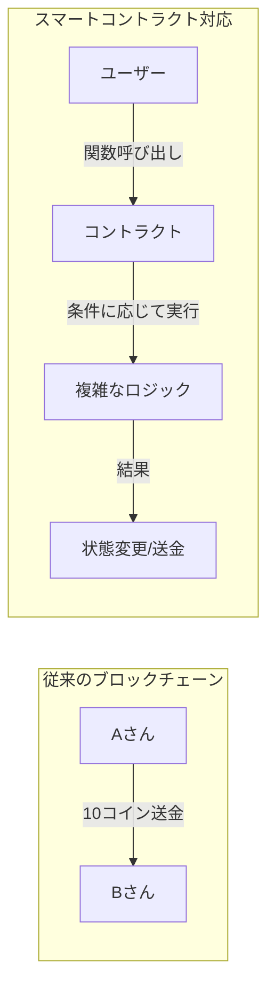
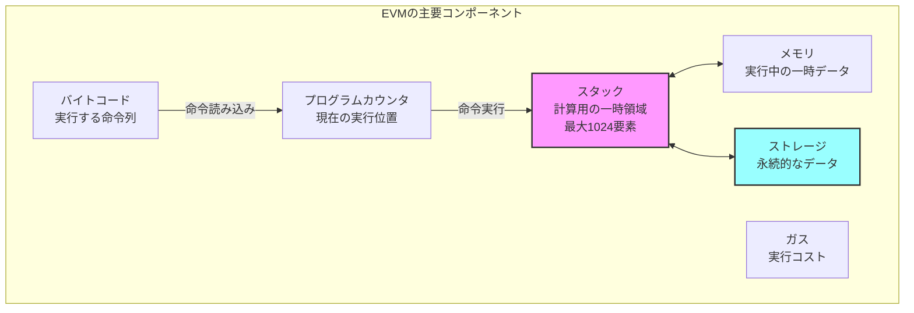

## なぜスマートコントラクトが必要なのか

第8章まででP2Pネットワークによるブロックチェーンの基本的な実装が完成しました。しかし、現在のシステムは「誰が誰にいくら送金したか」という単純な取引記録しか扱えません。

実際のビジネスや社会で使われるためには、より複雑なロジックが必要です：
- 条件付き送金（例：商品が届いたら支払う）
- 自動実行される契約（例：毎月の家賃支払い）
- 分散型の投票システム
- トークンの発行と管理

これらを実現するのが**スマートコントラクト**です。



## EVMとは何か

EVM（Ethereum Virtual Machine）は、ブロックチェーン上でプログラムを実行するための仮想マシンです。JavaがJVM上で動作するように、スマートコントラクトはEVM上で動作します。

### なぜ仮想マシンが必要か

1. **セキュリティ**: 悪意のあるコードから他のノードを保護
2. **決定性**: 全てのノードで同じ結果を保証
3. **計測可能性**: 実行コストを正確に計算（ガス）
4. **移植性**: どのプラットフォームでも同じように動作

## EVMの基本構造

EVMは**スタックベースの仮想マシン**です。計算はスタックを使って行われます。



### 各コンポーネントの役割

1. **スタック**: 計算の中心。全ての演算はここで行われる
2. **メモリ**: 実行中のみ有効な一時的な作業領域
3. **ストレージ**: コントラクトの状態を永続的に保存
4. **プログラムカウンタ**: 現在実行中の命令の位置
5. **ガス**: 無限ループを防ぐための実行コスト管理

## Zigで256ビット整数を実装する

EVMの特徴の一つは、256ビット整数を基本データ型として使うことです。Zigには標準で256ビット整数型がないため、独自に実装します。

### なぜ256ビットなのか

EVMが256ビット整数を採用した理由：

1. **暗号学的な要件**
   - Ethereumのアドレスは160ビット（20バイト）
   - Keccak-256ハッシュ値は256ビット（32バイト）
   - これらを1つの整数型で扱える

2. **金融計算の精度**
   - 10^77まで表現可能（2^256 ≈ 1.15 × 10^77）
   - Wei単位（10^-18 ETH）でも十分な精度を確保
   - オーバーフローのリスクを最小化

3. **効率的な実装**
   - 32バイト = 256ビットはメモリアライメントに適している
   - 多くのCPUが64ビット演算をサポート → 4回の演算で処理可能

### なぜ128ビット×2で実装するのか

256ビット整数を実装する方法：

1. **u64×4**: 最も汎用的だが、キャリー処理が複雑
2. **u128×2**: Zigがu128をサポートしているため効率的
3. **単一のu256**: Zigには存在しない

```text
256ビット整数の構造：
┌─────────────────────┬─────────────────────┐
│    上位128ビット    │    下位128ビット    │
│      (hi)           │      (lo)           │
└─────────────────────┴─────────────────────┘
```

### EVMu256型の実装

```zig
const std = @import("std");

/// EVM用の256ビット整数型
/// 上位128ビットと下位128ビットに分けて管理
pub const EVMu256 = struct {
    hi: u128, // 上位128ビット
    lo: u128, // 下位128ビット

    /// ゼロ値を作成
    pub fn zero() EVMu256 {
        return EVMu256{ .hi = 0, .lo = 0 };
    }

    /// 1を作成
    pub fn one() EVMu256 {
        return EVMu256{ .hi = 0, .lo = 1 };
    }

    /// u64から変換
    pub fn fromU64(value: u64) EVMu256 {
        return EVMu256{ .hi = 0, .lo = value };
    }

    /// 加算（オーバーフローはラップアラウンド）
    pub fn add(self: EVMu256, other: EVMu256) EVMu256 {
        // 下位128ビットの加算
        const result_lo = self.lo +% other.lo;
        // キャリー（桁上がり）の計算
        const carry = if (result_lo < self.lo) 1 else 0;
        // 上位128ビットの加算（キャリーを含む）
        const result_hi = self.hi +% other.hi +% carry;

        return EVMu256{ .hi = result_hi, .lo = result_lo };
    }

    /// 減算（アンダーフローはラップアラウンド）
    pub fn sub(self: EVMu256, other: EVMu256) EVMu256 {
        // 下位128ビットの減算
        const result_lo = self.lo -% other.lo;
        // ボロー（桁借り）の計算
        const borrow = if (self.lo < other.lo) 1 else 0;
        // 上位128ビットの減算（ボローを含む）
        const result_hi = self.hi -% other.hi -% borrow;

        return EVMu256{ .hi = result_hi, .lo = result_lo };
    }

    /// 等価比較
    pub fn eq(self: EVMu256, other: EVMu256) bool {
        return self.hi == other.hi and self.lo == other.lo;
    }

    /// ゼロかどうかの判定
    pub fn isZero(self: EVMu256) bool {
        return self.hi == 0 and self.lo == 0;
    }

    /// バイト配列への変換（ビッグエンディアン）
    pub fn toBytes(self: EVMu256) [32]u8 {
        var bytes: [32]u8 = undefined;

        // 上位128ビットをバイト配列に変換
        for (0..16) |i| {
            const shift = @as(u7, @intCast((15 - i) * 8));
            bytes[i] = @truncate(self.hi >> shift);
        }

        // 下位128ビットをバイト配列に変換
        for (0..16) |i| {
            const shift = @as(u7, @intCast((15 - i) * 8));
            bytes[i + 16] = @truncate(self.lo >> shift);
        }

        return bytes;
    }

    /// バイト配列からの変換（ビッグエンディアン）
    pub fn fromBytes(bytes: []const u8) EVMu256 {
        var hi: u128 = 0;
        var lo: u128 = 0;

        const len = @min(bytes.len, 32);
        const offset = if (len < 32) 32 - len else 0;

        for (bytes, 0..) |byte, i| {
            const pos = offset + i;
            if (pos < 16) {
                const shift = @as(u7, @intCast((15 - pos) * 8));
                hi |= @as(u128, byte) << shift;
            } else if (pos < 32) {
                const shift = @as(u7, @intCast((31 - pos) * 8));
                lo |= @as(u128, byte) << shift;
            }
        }

        return EVMu256{ .hi = hi, .lo = lo };
    }
};
```

## スタックの実装

EVMのスタックは最大1024要素を格納できるLIFO（Last In First Out）構造です。

### エラーハンドリングについて

EVMのスタック操作では、以下の2つのエラーが発生する可能性があります：

1. **StackOverflow**: スタックに1024個を超える要素をプッシュしようとした場合
2. **StackUnderflow**: 空のスタックからポップしようとした場合

これらのエラーは、スマートコントラクトの実行を即座に停止させ、トランザクション全体を失敗させます。
Zigのエラーハンドリング機構（`!`と`error`）を使って、これらを適切に処理します。

```zig
/// EVMスタック
pub const EvmStack = struct {
    data: [1024]EVMu256,  // 固定サイズ配列
    top: usize,           // スタックトップの位置

    /// 新しいスタックを作成
    pub fn init() EvmStack {
        return EvmStack{
            .data = undefined,  // 初期化は不要
            .top = 0,
        };
    }

    /// 値をプッシュ
    pub fn push(self: *EvmStack, value: EVMu256) !void {
        if (self.top >= 1024) {
            return error.StackOverflow;
        }
        self.data[self.top] = value;
        self.top += 1;
    }

    /// 値をポップ
    pub fn pop(self: *EvmStack) !EVMu256 {
        if (self.top == 0) {
            return error.StackUnderflow;
        }
        self.top -= 1;
        return self.data[self.top];
    }

    /// スタックの深さを取得
    pub fn depth(self: *const EvmStack) usize {
        return self.top;
    }

    /// n番目の要素を複製（DUP命令用）
    pub fn dup(self: *EvmStack, n: usize) !void {
        if (self.top < n) {
            return error.StackUnderflow;
        }
        if (self.top >= 1024) {
            return error.StackOverflow;
        }

        const value = self.data[self.top - n];
        self.data[self.top] = value;
        self.top += 1;
    }

    /// n番目の要素と交換（SWAP命令用）
    pub fn swap(self: *EvmStack, n: usize) !void {
        if (self.top < n + 1) {
            return error.StackUnderflow;
        }

        const temp = self.data[self.top - 1];
        self.data[self.top - 1] = self.data[self.top - n - 1];
        self.data[self.top - n - 1] = temp;
    }
};
```

## メモリの実装

EVMのメモリは動的に拡張可能なバイト配列です。

```zig
/// EVMメモリ
pub const EvmMemory = struct {
    data: std.ArrayList(u8),

    /// 新しいメモリを作成
    pub fn init(allocator: std.mem.Allocator) EvmMemory {
        return EvmMemory{
            .data = std.ArrayList(u8).init(allocator),
        };
    }

    /// メモリを解放
    pub fn deinit(self: *EvmMemory) void {
        self.data.deinit();
    }

    /// 32バイトのデータを保存
    pub fn store(self: *EvmMemory, offset: usize, value: EVMu256) !void {
        const end_offset = offset + 32;

        // メモリを必要に応じて拡張
        if (end_offset > self.data.items.len) {
            try self.data.resize(end_offset);
            // 新しい領域をゼロで初期化
            for (self.data.items[self.data.items.len..end_offset]) |*byte| {
                byte.* = 0;
            }
        }

        // 値をバイト配列に変換して書き込み
        const bytes = value.toBytes();
        @memcpy(self.data.items[offset..end_offset], &bytes);
    }

    /// 32バイトのデータを読み込み
    pub fn load(self: *const EvmMemory, offset: usize) EVMu256 {
        const end_offset = offset + 32;

        if (end_offset <= self.data.items.len) {
            return EVMu256.fromBytes(self.data.items[offset..end_offset]);
        } else {
            // 範囲外の場合は0を返す
            return EVMu256.zero();
        }
    }

    /// 任意のバイト列を書き込み
    pub fn writeBytes(self: *EvmMemory, offset: usize, data: []const u8) !void {
        const end_offset = offset + data.len;

        if (end_offset > self.data.items.len) {
            try self.data.resize(end_offset);
        }

        @memcpy(self.data.items[offset..end_offset], data);
    }

    /// 現在のメモリサイズを取得
    pub fn size(self: *const EvmMemory) usize {
        return self.data.items.len;
    }
};
```

## ストレージの実装

ストレージは永続的なキー・値ストアです。

```zig
/// EVMストレージ
pub const EvmStorage = struct {
    data: std.AutoHashMap(EVMu256, EVMu256),

    /// 新しいストレージを作成
    pub fn init(allocator: std.mem.Allocator) EvmStorage {
        return EvmStorage{
            .data = std.AutoHashMap(EVMu256, EVMu256).init(allocator),
        };
    }

    /// ストレージを解放
    pub fn deinit(self: *EvmStorage) void {
        self.data.deinit();
    }

    /// 値を保存
    pub fn store(self: *EvmStorage, key: EVMu256, value: EVMu256) !void {
        // ゼロ値の場合は削除（ガス節約のため）
        if (value.isZero()) {
            _ = self.data.remove(key);
        } else {
            try self.data.put(key, value);
        }
    }

    /// 値を読み込み
    pub fn load(self: *const EvmStorage, key: EVMu256) EVMu256 {
        return self.data.get(key) orelse EVMu256.zero();
    }

    /// ストレージをクリア
    pub fn clear(self: *EvmStorage) void {
        self.data.clearAndFree();
    }
};
```

## EVMコンテキストの定義

実行時の状態を管理する構造体です。ここで重要なエラーハンドリングについて説明します：

### ガス不足エラー（OutOfGas）

EVMでは各命令の実行にガスコストが設定されています。ガスが不足すると：
- トランザクション全体がリバート（巻き戻し）される
- 状態変更は全て取り消される
- 使用済みのガスは返却されない

これにより、無限ループや過度に複雑な計算からネットワークを保護します。

```zig
/// EVM実行コンテキスト
pub const EvmContext = struct {
    stack: EvmStack,
    memory: EvmMemory,
    storage: EvmStorage,
    pc: usize,                      // プログラムカウンタ
    code: []const u8,               // 実行するバイトコード
    calldata: []const u8,           // 呼び出しデータ
    gas_remaining: usize,           // 残りガス
    gas_used: usize,                // 使用済みガス
    return_data: ?[]const u8,       // 戻り値データ
    stopped: bool,                  // 実行停止フラグ
    reverted: bool,                 // リバートフラグ
    allocator: std.mem.Allocator,

    /// コンテキストを初期化
    pub fn init(
        allocator: std.mem.Allocator,
        code: []const u8,
        calldata: []const u8,
        gas_limit: usize,
    ) EvmContext {
        return EvmContext{
            .stack = EvmStack.init(),
            .memory = EvmMemory.init(allocator),
            .storage = EvmStorage.init(allocator),
            .pc = 0,
            .code = code,
            .calldata = calldata,
            .gas_remaining = gas_limit,
            .gas_used = 0,
            .return_data = null,
            .stopped = false,
            .reverted = false,
            .allocator = allocator,
        };
    }

    /// コンテキストを解放
    pub fn deinit(self: *EvmContext) void {
        self.memory.deinit();
        self.storage.deinit();
    }

    /// ガスを消費
    pub fn useGas(self: *EvmContext, amount: usize) !void {
        if (self.gas_remaining < amount) {
            return error.OutOfGas;
        }
        self.gas_remaining -= amount;
        self.gas_used += amount;
    }
};
```

## 簡単なテストプログラム

実装したデータ構造をテストしてみましょう：

```zig
const std = @import("std");
const evm_types = @import("evm_types.zig");

test "EVMu256 arithmetic" {
    const a = evm_types.EVMu256.fromU64(100);
    const b = evm_types.EVMu256.fromU64(200);
    const c = a.add(b);

    try std.testing.expect(c.lo == 300);
    try std.testing.expect(c.hi == 0);
}

test "Stack operations" {
    var stack = evm_types.EvmStack.init();

    // プッシュ
    try stack.push(evm_types.EVMu256.fromU64(10));
    try stack.push(evm_types.EVMu256.fromU64(20));

    // ポップ
    const b = try stack.pop();
    const a = try stack.pop();

    try std.testing.expect(a.lo == 10);
    try std.testing.expect(b.lo == 20);
}

test "Memory operations" {
    const allocator = std.testing.allocator;
    var memory = evm_types.EvmMemory.init(allocator);
    defer memory.deinit();

    // 書き込み
    const value = evm_types.EVMu256.fromU64(0x1234);
    try memory.store(0, value);

    // 読み込み
    const loaded = memory.load(0);
    try std.testing.expect(loaded.eq(value));
}

test "Storage operations" {
    const allocator = std.testing.allocator;
    var storage = evm_types.EvmStorage.init(allocator);
    defer storage.deinit();

    // 保存
    const key = evm_types.EVMu256.fromU64(1);
    const value = evm_types.EVMu256.fromU64(100);
    try storage.store(key, value);

    // 読み込み
    const loaded = storage.load(key);
    try std.testing.expect(loaded.eq(value));
}
```

## まとめ

本章では、EVMの基本的なデータ構造を実装しました：

1. **256ビット整数型**: EVMの基本データ型
2. **スタック**: 最大1024要素のLIFO構造
3. **メモリ**: 動的に拡張可能な一時領域
4. **ストレージ**: 永続的なキー・値ストア
5. **実行コンテキスト**: 実行状態を管理

これらの基盤の上に、次章ではオペコード（命令）を実装し、実際にプログラムを実行できるようにします。

## 演習問題

1. **EVMu256の乗算**を実装してみましょう（ヒント：128ビット×128ビットの結果は256ビット）
2. **スタックの表示関数**を作成し、現在のスタックの状態を可視化してみましょう
3. **メモリのダンプ機能**を実装し、メモリの内容を16進数で表示してみましょう
4. **ストレージの永続化**を実装し、ファイルに保存・読み込みできるようにしてみましょう

次章では、これらのデータ構造を使って実際のEVMオペコードを実装します。
