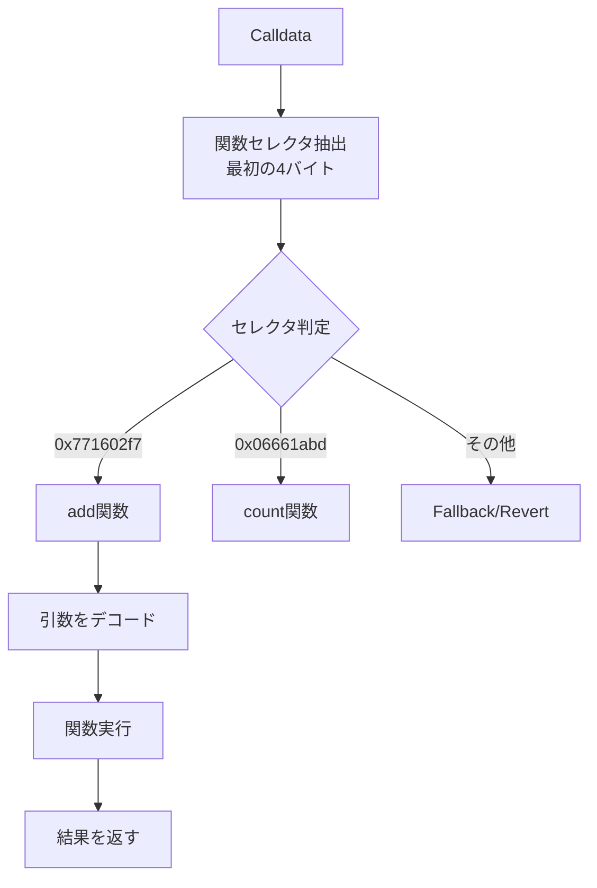

## 実際のSolidityスマートコントラクトを実行する

前章までで基本的なオペコードを実装しました。本章では、制御フロー（条件分岐）、関数呼び出し、ストレージ操作を実装し、実際のSolidityコントラクトを実行できるEVMを完成させます。

## 制御フローの実装

### JUMP（0x56）とJUMPDEST（0x5B）

無条件ジャンプの実装：

```zig
Opcode.JUMP => {
    const dest = try ctx.stack.pop();
    const jump_pc = @as(usize, @intCast(dest.lo));
    
    // ジャンプ先の検証
    if (jump_pc >= ctx.code.len) {
        return error.InvalidJumpDestination;
    }
    if (ctx.code[jump_pc] != Opcode.JUMPDEST) {
        return error.InvalidJumpDestination;
    }
    
    ctx.pc = jump_pc;
},

Opcode.JUMPDEST => {
    // ジャンプ先マーカー（何もしない）
},
```

### JUMPI（0x57）- 条件付きジャンプ

```zig
Opcode.JUMPI => {
    const dest = try ctx.stack.pop();
    const condition = try ctx.stack.pop();
    
    // 条件が真（非ゼロ）の場合のみジャンプ
    if (condition.hi != 0 or condition.lo != 0) {
        const jump_pc = @as(usize, @intCast(dest.lo));
        
        if (jump_pc >= ctx.code.len) {
            return error.InvalidJumpDestination;
        }
        if (ctx.code[jump_pc] != Opcode.JUMPDEST) {
            return error.InvalidJumpDestination;
        }
        
        ctx.pc = jump_pc;
    } else {
        ctx.pc += 1;
    }
},
```

## 関数呼び出しの実装

### CALLDATALOAD（0x35）- 呼び出しデータの読み込み

```zig
Opcode.CALLDATALOAD => {
    const offset = try ctx.stack.pop();
    const offset_usize = @as(usize, @intCast(offset.lo));
    
    var bytes: [32]u8 = [_]u8{0} ** 32;
    const available = if (offset_usize < ctx.calldata.len) 
        @min(32, ctx.calldata.len - offset_usize) 
    else 
        0;
    
    if (available > 0) {
        @memcpy(bytes[0..available], ctx.calldata[offset_usize..offset_usize + available]);
    }
    
    try ctx.stack.push(EVMu256.fromBytes(&bytes));
},
```

### RETURN（0xF3）- 実行結果を返す

```zig
Opcode.RETURN => {
    const offset = try ctx.stack.pop();
    const length = try ctx.stack.pop();
    
    const mem_offset = @as(usize, @intCast(offset.lo));
    const mem_length = @as(usize, @intCast(length.lo));
    
    if (mem_offset + mem_length <= ctx.memory.data.items.len) {
        ctx.return_data = ctx.memory.data.items[mem_offset..mem_offset + mem_length];
    }
    
    ctx.stopped = true;
},
```

## ストレージ操作

### SSTORE（0x55）- ストレージに保存

```zig
Opcode.SSTORE => {
    const key = try ctx.stack.pop();
    const value = try ctx.stack.pop();
    try ctx.storage.store(key, value);
},
```

### SLOAD（0x54）- ストレージから読み込み

```zig
Opcode.SLOAD => {
    const key = try ctx.stack.pop();
    const value = ctx.storage.load(key);
    try ctx.stack.push(value);
},
```

## 実際のSolidityコントラクトの実行

### SimpleAdderコントラクト

まず、簡単な加算コントラクトを作成します：

```solidity
// SimpleAdder.sol
pragma solidity ^0.8.0;

contract SimpleAdder {
    function add(uint256 a, uint256 b) public pure returns (uint256) {
        return a + b;
    }
}
```

### コンパイルとバイトコード

Solidityコンパイラでバイトコードを生成：

```bash
solc --bin --abi SimpleAdder.sol
```

### Zigでの実行

```zig
pub fn main() !void {
    const allocator = std.heap.page_allocator;
    
    // SimpleAdderのランタイムバイトコード（一部抜粋）
    const runtime_code = try std.fmt.hexToBytes(allocator, 
        "608060405234801561000f575f80fd5b5060043610610029..."
    );
    defer allocator.free(runtime_code);
    
    // add(5, 3)を呼び出すためのcalldata
    // 0x771602f7 = add関数のセレクタ
    // その後に引数5と3が続く
    const calldata = try std.fmt.hexToBytes(allocator,
        "771602f7" ++
        "0000000000000000000000000000000000000000000000000000000000000005" ++
        "0000000000000000000000000000000000000000000000000000000000000003"
    );
    defer allocator.free(calldata);
    
    // EVM実行
    var ctx = EvmContext.init(allocator, runtime_code, calldata, 3000000);
    defer ctx.deinit();
    
    try execute(&ctx);
    
    // 結果の確認
    if (ctx.return_data) |data| {
        const result = EVMu256.fromBytes(data);
        std.debug.print("Result: {d}\n", .{result.lo}); // 8が出力される
    }
}
```

## より複雑なコントラクト：カウンター

ストレージを使うカウンターコントラクト：

```solidity
// Counter.sol
pragma solidity ^0.8.0;

contract Counter {
    uint256 public count;
    
    function increment() public {
        count += 1;
    }
    
    function getCount() public view returns (uint256) {
        return count;
    }
}
```

このコントラクトは：
1. `count`変数をストレージに保存
2. `increment()`でカウントを増加
3. `getCount()`で現在の値を取得

## 関数セレクタの仕組み

Solidityの関数呼び出しは以下の流れで処理されます：



## EVMの実行フロー

完全なEVM実行の流れ：

```zig
/// コントラクトを呼び出す
pub fn callContract(
    allocator: std.mem.Allocator,
    code: []const u8,
    calldata: []const u8,
    gas_limit: usize,
) ![]const u8 {
    // 1. コンテキストを初期化
    var ctx = EvmContext.init(allocator, code, calldata, gas_limit);
    defer ctx.deinit();
    
    // 2. バイトコードを実行
    try execute(&ctx);
    
    // 3. 結果を返す
    if (ctx.return_data) |data| {
        const result = try allocator.alloc(u8, data.len);
        @memcpy(result, data);
        return result;
    }
    
    return &[_]u8{};
}
```

## エラーハンドリング

EVMのエラー処理：

```zig
pub const EVMError = error{
    OutOfGas,
    StackOverflow,
    StackUnderflow,
    InvalidJumpDestination,
    InvalidOpcode,
    OutOfBounds,
    StorageError,
    MemoryError,
};

// 実行時のエラー処理
execute(&ctx) catch |err| {
    switch (err) {
        error.OutOfGas => {
            std.log.err("Out of gas at PC={}", .{ctx.pc});
            // トランザクションをリバート
        },
        error.InvalidOpcode => {
            std.log.err("Invalid opcode: 0x{x:0>2}", .{ctx.code[ctx.pc]});
            // トランザクションをリバート
        },
        else => return err,
    }
};
```

## パフォーマンス最適化

実用的なEVMでは以下の最適化が重要です：

1. **ジャンプテーブルの事前計算**
```zig
// 有効なジャンプ先を事前に計算
pub fn analyzeJumpDests(code: []const u8) !std.AutoHashMap(usize, void) {
    var valid_dests = std.AutoHashMap(usize, void).init(allocator);
    
    for (code, 0..) |opcode, i| {
        if (opcode == Opcode.JUMPDEST) {
            try valid_dests.put(i, {});
        }
    }
    
    return valid_dests;
}
```

2. **ガス計算の最適化**
```zig
// 静的なガスコストをコンパイル時に計算
const gas_table = comptime blk: {
    var table: [256]usize = undefined;
    table[Opcode.STOP] = 0;
    table[Opcode.ADD] = 3;
    // ... 他のオペコード
    break :blk table;
};
```

## まとめ

本章で実装した機能により、実際のSolidityスマートコントラクトを実行できるEVMが完成しました：

1. **制御フロー**: JUMP、JUMPI、JUMPDESTによる条件分岐
2. **関数呼び出し**: CALLDATALOADとRETURNによる入出力
3. **永続化**: SSTOREとSLOADによるストレージ操作
4. **実用例**: SimpleAdderとCounterコントラクトの実行

これで、基本的なスマートコントラクトを実行できるブロックチェーンが完成しました！

## 今後の拡張

実際のEthereumにはさらに多くの機能があります：

- **外部呼び出し**: CALL、DELEGATECALL、STATICCALL
- **コントラクト作成**: CREATE、CREATE2
- **イベント**: LOG0〜LOG4
- **プリコンパイルコントラクト**: 暗号学的処理の高速化

これらの実装により、より完全なEVM互換チェーンを構築できます。

## 演習問題

1. **Counterコントラクト**を実際にコンパイルして実行してみましょう
2. **条件分岐を使った簡単なコントラクト**（例：最大値を返す関数）を実装してみましょう
3. **イベントログ（LOG0）**オペコードを実装してみましょう
4. **ガス使用量の詳細なレポート**を生成する機能を追加してみましょう