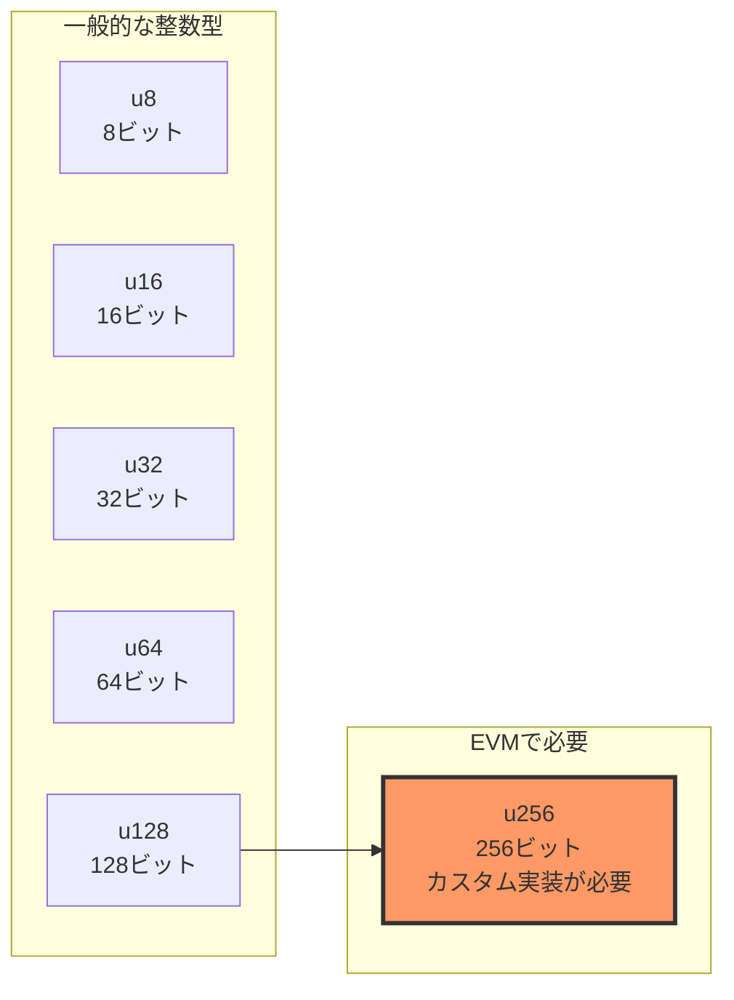

# 256ビット整数の実装

[← 第9章-1: EVMの基本概念](./chapter9_basics.md) | [第9章-3: データ構造の実装 →](./chapter9_datastructures.md)

## なぜ256ビット整数が必要なのか

EVMは256ビット（32バイト）を基本単位とするスタックマシンです。これは、暗号学的ハッシュ（SHA-256やKeccak-256）の出力サイズや、楕円曲線暗号で使用される数値の範囲に合わせた設計です。

しかし、多くのプログラミング言語（Zigを含む）では、標準で提供される整数型は最大でも128ビット（`u128`）や64ビット（`u64`）です。そのため、EVMを実装するには独自の256ビット整数型を作成する必要があります。



## 256ビット整数の内部表現

256ビットの整数を表現する最もシンプルな方法は、2つの128ビット整数を組み合わせることです：

- 上位128ビット（`hi`）: 値の大きい側の半分
- 下位128ビット（`lo`）: 値の小さい側の半分

```text
256ビット整数 = [上位128ビット (hi)] [下位128ビット (lo)]
                ←――――――――― 256ビット ――――――――→
```

### 具体例

例えば、数値`1`を256ビット整数で表現すると：

```text
hi = 0x0000000000000000000000000000000 (128ビット)
lo = 0x0000000000000000000000000000001 (128ビット)
```

大きな数値、例えば`2^128`（128ビット目が1）の場合：

```text
hi = 0x0000000000000000000000000000001 (128ビット)
lo = 0x0000000000000000000000000000000 (128ビット)
```

## Zigでの実装

それでは、ZigでEVM用の256ビット整数型`EVMu256`を実装してみましょう。
evm_types.zigを新規に作成します。

### 基本構造体の定義

```zig
//! EVM用の256ビット整数型
pub const EVMu256 = struct {
    hi: u128, // 上位128ビット
    lo: u128, // 下位128ビット

    /// ゼロ値を返す
    pub fn zero() EVMu256 {
        return EVMu256{ .hi = 0, .lo = 0 };
    }

    /// 64ビット整数から変換
    pub fn fromU64(value: u64) EVMu256 {
        return EVMu256{ .hi = 0, .lo = value };
    }
};
```

この構造体は、シンプルに2つの`u128`フィールドを持ちます。

### 加算の実装

256ビット整数の加算では、桁上がり（キャリー）の処理が重要です。

```zig
/// 加算（オーバーフロー対応）
pub fn add(self: EVMu256, other: EVMu256) EVMu256 {
    // まず下位128ビット同士を加算
    const result_lo = self.lo +% other.lo;

    // キャリーが発生したかチェック
    // result_lo < self.lo なら、オーバーフローしてキャリーが発生した
    const carry: u128 = if (result_lo < self.lo) 1 else 0;

    // 上位128ビットを加算（キャリーも含む）
    const result_hi = self.hi +% other.hi +% carry;

    return EVMu256{ .hi = result_hi, .lo = result_lo };
}
```

重要なポイント。

- `+%`演算子：Zigのラッピング加算（オーバーフロー時に折り返す）
- キャリー検出：`result_lo < self.lo`でオーバーフロー判定
- 上位ビットへのキャリー伝播

### 加算の動作例

```text
例1: 小さな数の加算（キャリーなし）
  self:  hi=0, lo=10
  other: hi=0, lo=20
  ────────────────────
  result: hi=0, lo=30

例2: キャリーが発生する加算
  self:  hi=0, lo=0xFFFFFFFFFFFFFFFFFFFFFFFFFFFFFFFF (128ビット最大値)
  other: hi=0, lo=1
  ────────────────────
  result_lo = 0 (オーバーフロー)
  carry = 1
  result: hi=1, lo=0
```

### 減算の実装

減算では、借り入れ（ボロー）の処理が必要です。

```zig
/// 減算（アンダーフロー対応）
pub fn sub(self: EVMu256, other: EVMu256) EVMu256 {
    // まず下位128ビット同士を減算
    const result_lo = self.lo -% other.lo;

    // ボローが発生したかチェック
    // self.lo < other.lo なら、ボローが発生した
    const borrow: u128 = if (self.lo < other.lo) 1 else 0;

    // 上位128ビットを減算（ボローも考慮）
    const result_hi = self.hi -% other.hi -% borrow;

    return EVMu256{ .hi = result_hi, .lo = result_lo };
}
```

### 乗算の実装（簡易版）

完全な256ビット乗算は非常に複雑なため、まずは簡易版を実装します：

```zig
/// 乗算（簡易版）
/// 注意: 両方の値が小さい場合のみ正確
pub fn mul(self: EVMu256, other: EVMu256) EVMu256 {
    // 両方の上位ビットが0の場合のみ正確に計算
    if (self.hi == 0 and other.hi == 0) {
        // Zigのネイティブ256ビット演算を使用
        const result = @as(u256, self.lo) * @as(u256, other.lo);
        return EVMu256{
            .hi = @truncate(result >> 128),
            .lo = @truncate(result),
        };
    }

    // それ以外は簡易的に下位ビットのみで処理
    return EVMu256{
        .hi = 0,
        .lo = self.lo *% other.lo,
    };
}
```

## バイト配列との変換

EVMでは、メモリやストレージとの間でデータをやり取りする際、256ビット整数を32バイトのバイト配列として扱います。

### 256ビット整数 → バイト配列

```zig
/// バイト配列への変換（ビッグエンディアン）
pub fn toBytes(self: EVMu256) [32]u8 {
    var bytes: [32]u8 = undefined;

    // 上位128ビット（16バイト）を配列の前半に配置
    for (0..16) |i| {
        bytes[i] = @truncate((self.hi >> @as(u7, @intCast((15 - i) * 8))));
    }

    // 下位128ビット（16バイト）を配列の後半に配置
    for (0..16) |i| {
        bytes[i + 16] = @truncate((self.lo >> @as(u7, @intCast((15 - i) * 8))));
    }

    return bytes;
}
```

ビッグエンディアン形式。

- 最も大きい桁（上位バイト）が配列の先頭に来る
- EVMの標準的なバイト順序

### バイト配列 → 256ビット整数

```zig
/// バイト配列からの変換（ビッグエンディアン）
pub fn fromBytes(bytes: []const u8) EVMu256 {
    var hi: u128 = 0;
    var lo: u128 = 0;

    const len = @min(bytes.len, 32);
    const offset = if (len < 32) 32 - len else 0;

    for (bytes, 0..) |byte, i| {
        const pos = offset + i;
        if (pos < 16) {
            // 上位128ビットの構築
            hi |= @as(u128, byte) << @as(u7, @intCast((15 - pos) * 8));
        } else if (pos < 32) {
            // 下位128ビットの構築
            lo |= @as(u128, byte) << @as(u7, @intCast((31 - pos) * 8));
        }
    }

    return EVMu256{ .hi = hi, .lo = lo };
}
```

## 比較演算

EVMでは、値の大小比較も頻繁に行われます。

```zig
/// 等価性チェック
pub fn eq(self: EVMu256, other: EVMu256) bool {
    return self.hi == other.hi and self.lo == other.lo;
}

/// より小さいかチェック
pub fn lt(self: EVMu256, other: EVMu256) bool {
    if (self.hi != other.hi) {
        return self.hi < other.hi;
    }
    return self.lo < other.lo;
}

/// より大きいかチェック
pub fn gt(self: EVMu256, other: EVMu256) bool {
    if (self.hi != other.hi) {
        return self.hi > other.hi;
    }
    return self.lo > other.lo;
}
```

## 最終的に出来上がったもの

```evm_types.zig
//! EVMデータ構造定義
//!
//! このモジュールはEthereum Virtual Machine (EVM)の実行に必要な
//! データ構造を定義します。スマートコントラクト実行環境に
//! 必要なスタック、メモリ、ストレージなどの構造体を含みます。

const std = @import("std");

/// 256ビット整数型（EVMの基本データ型）
/// 現在はu128の2つの要素で256ビットを表現
pub const EVMu256 = struct {
    // 256ビットを2つのu128値で表現（上位ビットと下位ビット）
    hi: u128, // 上位128ビット
    lo: u128, // 下位128ビット

    /// ゼロ値の作成
    pub fn zero() EVMu256 {
        return EVMu256{ .hi = 0, .lo = 0 };
    }

    /// u64値からEVMu256を作成
    pub fn fromU64(value: u64) EVMu256 {
        return EVMu256{ .hi = 0, .lo = value };
    }

    /// 加算演算
    pub fn add(self: EVMu256, other: EVMu256) EVMu256 {
        var result = EVMu256{ .hi = self.hi, .lo = self.lo };
        // 修正: Zigの最新バージョンに合わせて@addWithOverflow呼び出しを変更
        var overflow: u1 = 0;
        result.lo, overflow = @addWithOverflow(result.lo, other.lo);
        // オーバーフローした場合は上位ビットに1を加算
        result.hi = result.hi + other.hi + overflow;
        return result;
    }

    /// 減算演算
    pub fn sub(self: EVMu256, other: EVMu256) EVMu256 {
        var result = EVMu256{ .hi = self.hi, .lo = self.lo };
        // 修正: Zigの最新バージョンに合わせて@subWithOverflow呼び出しを変更
        var underflow: u1 = 0;
        result.lo, underflow = @subWithOverflow(result.lo, other.lo);
        // アンダーフローした場合は上位ビットから1を引く
        result.hi = result.hi - other.hi - underflow;
        return result;
    }

    /// 乗算演算（シンプル実装 - 実際には最適化が必要）
    pub fn mul(self: EVMu256, other: EVMu256) EVMu256 {
        // 簡易実装: 下位ビットのみの乗算
        // 注：完全な256ビット乗算は複雑なため、ここでは省略
        if (self.hi == 0 and other.hi == 0) {
            const result_lo = self.lo * other.lo;
            // シフト演算で上位ビットを取得
            // 128ビットシフトを避けるために、別の方法で計算
            // 注: u128に入らない上位ビットは無視される
            const result_hi = @as(u128, 0); // 簡略化した実装では上位ビットは0として扱う
            return EVMu256{ .hi = result_hi, .lo = result_lo };
        } else {
            // 簡易実装のため、上位ビットがある場合は詳細計算を省略
            return EVMu256{ .hi = 0, .lo = 0 };
        }
    }

    /// 等価比較
    pub fn eql(self: EVMu256, other: EVMu256) bool {
        return self.hi == other.hi and self.lo == other.lo;
    }

    /// フォーマット出力用メソッド
    /// std.fmt.Formatインターフェースに準拠
    pub fn format(
        self: EVMu256,
        comptime fmt: []const u8,
        options: std.fmt.FormatOptions,
        writer: anytype,
    ) !void {
        // options is used in some format cases below

        if (fmt.len == 0 or fmt[0] == 'd') {
            // 10進数表示
            if (self.hi == 0) {
                // 上位ビットが0の場合は単純に下位ビットを表示
                try std.fmt.formatInt(self.lo, 10, .lower, options, writer);
            } else {
                // 本来は256ビット数値を正確に10進変換する必要があるが、簡易表示
                try writer.writeAll("0x");
                try std.fmt.formatInt(self.hi, 16, .lower, .{}, writer);
                try writer.writeByte('_');
                try std.fmt.formatInt(self.lo, 16, .lower, .{}, writer);
            }
        } else if (fmt[0] == 'x' or fmt[0] == 'X') {
            // 16進数表示
            const case: std.fmt.Case = if (fmt[0] == 'X') .upper else .lower;
            try writer.writeAll("0x");

            // 上位ビットが0でなければ表示
            if (self.hi != 0) {
                try std.fmt.formatInt(self.hi, 16, case, .{ .fill = '0', .width = 32 }, writer);
            }

            try std.fmt.formatInt(self.lo, 16, case, .{ .fill = '0', .width = 32 }, writer);
        } else {
            // 不明なフォーマット指定子の場合はデフォルトで16進表示
            try writer.writeAll("0x");
            if (self.hi != 0) {
                try std.fmt.formatInt(self.hi, 16, .lower, .{}, writer);
                try writer.writeByte('_');
            }
            try std.fmt.formatInt(self.lo, 16, .lower, .{}, writer);
        }
    }
};
```

## テストコードの例

実装した256ビット整数が正しく動作するか確認しましょう：

```zig
test "EVMu256 basic operations" {
    const std = @import("std");
    const expect = std.testing.expect;

    // ゼロ値のテスト
    const zero = EVMu256.zero();
    try expect(zero.hi == 0 and zero.lo == 0);

    // 加算のテスト
    const a = EVMu256.fromU64(10);
    const b = EVMu256.fromU64(20);
    const sum = a.add(b);
    try expect(sum.lo == 30);

    // キャリー発生のテスト
    const max_lo = EVMu256{ .hi = 0, .lo = 0xFFFFFFFFFFFFFFFFFFFFFFFFFFFFFFFF };
    const one = EVMu256.fromU64(1);
    const carry_result = max_lo.add(one);
    try expect(carry_result.hi == 1 and carry_result.lo == 0);
}
```

## まとめ

本章では、EVMの基盤となる256ビット整数型`EVMu256`を実装しました。

実装したポイント。

- 2つの128ビット整数による内部表現
- キャリー/ボローを考慮した加算・減算
- 簡易版の乗算
- バイト配列との相互変換
- 比較演算

次章では、この`EVMu256`型を使用して、EVMの主要データ構造（スタック、メモリ、ストレージ）を実装します。
